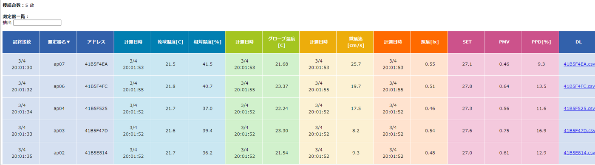

# Starting measurement and the data

## Making the M-Logger start sending

With MLServer running, start the measurement of the M-Logger from the smartphone app.

- In [Measurement settings](../mobile/settings.md), choose **PC** as the destination and start the measurement. From then on, the M-Logger sends its readings to the coordinator over Zigbee.
- To make the measurement restart automatically when the power is turned on again (for example after replacing the batteries), use [permanent mode](../mobile/advanced.md#switching-to-permanent-mode).

When MLServer receives readings, it prints them on its screen.

## Saved files

The readings are appended to `data/<address>.csv` for each M-Logger. `<address>` is the lower 8 digits of the XBee address of the M-Logger (for example `420266B3`).

| Column | Contents |
|---|---|
| Server Timestamp | Date and time received by MLServer |
| Client Timestamp | Date and time measured by the M-Logger (`n/a` if its clock is not set) |
| Drybulb temperature[C] | Dry-bulb temperature [°C] |
| Relative humidity[%] | Relative humidity [%] |
| Globe temperature[C] | Globe temperature [°C] |
| Velocity[m/s] | Air velocity [m/s] |
| Illuminance[lux] | Illuminance [lx] |
| CO2 concentration[ppm] | CO2 concentration [ppm] <span class="fw">v4+</span> |
| Voltage for velocity measurement[V] | Voltage of the air velocity sensor [V] |
| Future Placeholder | (reserved) |
| Mean radiant temperature[C] | Mean radiant temperature [°C] |
| WBGT (Indoor)[C] | WBGT (indoor) [°C] |
| WBGT (Outdoor)[C] | WBGT (outdoor) [°C] |

Items that are not measured, or not received at that time, are `n/a`.

## Clock

MLServer sets the clock of the M-Logger automatically. If the clock of the M-Logger is not set (for example after replacing the batteries), use the time received by MLServer (Server Timestamp) as the measurement time.

## Browser display

Opening `data/index.htm` in a browser shows a list of the latest readings of each M-Logger and the thermal comfort indices calculated from them (PMV, PPD, SET\*). The list is updated every second. The link at the right end of each row downloads the CSV of that M-Logger.



In some browsers the display is not updated when `index.htm` is opened directly as a file. In that case, publish it with a web server as described below and open it from there.

The latest values are written to `data/latest.json`, which the list page reads.

### Heat map

When the heat map is enabled on the list page, the readings are shown in colors on a floor plan.

{ width="600" }

It needs the following preparation.

1. **Background image**: place a PNG image 1000 px wide as `data/background.png`.
2. **Regions**: in `drawRegion` of `data/draw.js`, write the region on the image for each M-Logger. The top-left of the image is (0, 0), with x to the right and y downward.
    - Rectangle: `rect(x0, y0, x1, y1)` (two opposite corners)
    - Polygon: list the vertices with `vertex(x, y);` between `beginShape();` and `endShape(CLOSE);`

```javascript
function drawRegion(mloggerID){
  rectMode(CORNERS);
  switch(mloggerID){
    case "42114F57":            // address of the M-Logger (lower 8 digits)
      rect(55, 50, 160, 530);
      break;
    case "420BCCD1":
      beginShape();
      vertex(160,180);
      vertex(510,180);
      vertex(510,315);
      vertex(160,315);
      endShape(CLOSE);
      break;
  }
}
```

3. **Color range**: in `data/config.js`, set the upper and lower limits of the colors (`max_tmp`, `min_tmp`, etc.) and whether to adjust them automatically (`auto_color_range`).

### Viewing from a remote location

Publishing the `data` folder with a web server lets you check the measurement from a remote location in a browser. On a Raspberry Pi, use a web server such as Apache.

```
# Apache example (/etc/apache2/sites-available/000-default.conf)
DocumentRoot /home/pi/MLServer/data
<Directory /home/pi/MLServer/data/>
    Options Indexes FollowSymLinks
    AllowOverride None
    Require all granted
</Directory>
```
