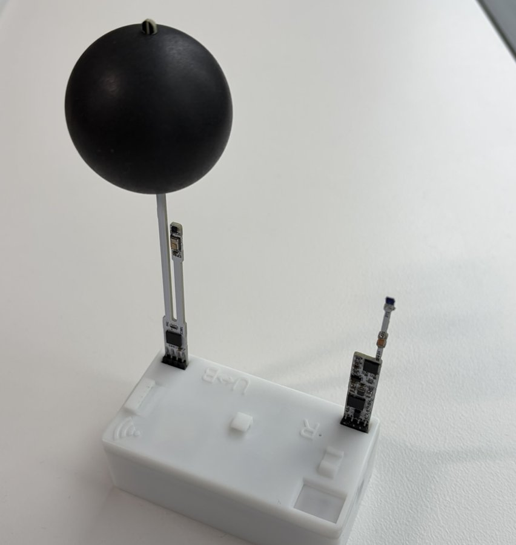
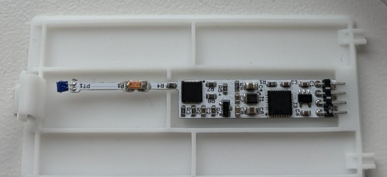

# Basic device operation

This page covers the device-side operations and indications that the software refers to. Specifications and calibration are out of scope.

=== "v4 firmware"

    ## Assembly

    Plug the temperature/humidity/CO2 probe (with globe) and the air velocity probe into the two sockets on the top of the device. The two sockets are identical, so either probe can go into either socket.

    { width="450" }

    ## Parts of the device

    { width="600" }

    | No. | Name | Description |
    |---|---|---|
    | 1 | Reset button (small hole left of `R`) | Hold to cancel permanent mode. Also used to update the firmware |
    | 2 | Power switch (`U↔B`) | `U`: USB power, `B`: battery power |
    | 3 | USB Type-C | Communication with a PC and USB power |
    | 4 | LED | Also serves as the diffuser of the illuminance sensor |
    | 5 | Probe sockets | For the temperature/humidity/CO2 probe and the air velocity probe, in either order |

    ## Power

    The power switch selects between USB power (`U`) and battery power (`B`).

    - For battery operation, set it to `B`.
    - For USB power, set it to `U` and connect a USB cable.

    If batteries are inserted and a USB cable is connected, the device stays on whichever way the switch is set. To turn it off, remove the power source that is not in use (the batteries or the USB cable).

    ## Batteries

    The battery box is on the bottom of the device. It takes two AA batteries.

    - Alkaline batteries and rechargeable NiMH batteries can both be used.
    - When the battery voltage drops, the device stops measuring and signals it with the red LED (see the table below).

    The air velocity probe can be stored by plugging it into the inside of the battery cover. Keep it there when you do not measure air velocity or when carrying the device.

    { width="500" }

    ## LED indications

    | Indication | State |
    |---|---|
    | Green blinks every second | Idle (not measuring) |
    | Green blinks every 5 seconds | Measuring |
    | Red blinks every second | Transferring recorded data (other operations are not accepted meanwhile) |
    | Green and red blink every second | Calibrating the CO2 sensor |
    | Red on | The Reset button is pressed |
    | Red blinks 3 times | Permanent mode was cancelled (Reset button held), or the built-in memory is full |
    | Red blinks once every 3 seconds | Low battery voltage. Replace the batteries |
    | Red blinks twice every 3 seconds | Radio module (XBee) error |

    ## Reset button

    The Reset button is inside the small hole just to the left of the `R` mark. Press it with a thin rod such as the tip of a paper clip. It is rarely needed, so you may also remove the top cover to press it.

    - **Hold for 3 seconds or more**: cancels permanent mode and restarts the device. The red LED blinks 3 times.
    - **Hold while turning the power on**: puts the device into firmware update mode. Used in [Updating the firmware](firmware_update.md).

=== "v3 firmware"

    For v3 device operation, see the [Hardware operation manual (PDF, Japanese)](https://mlogger.jp/ja/document_3.4.1.pdf).
