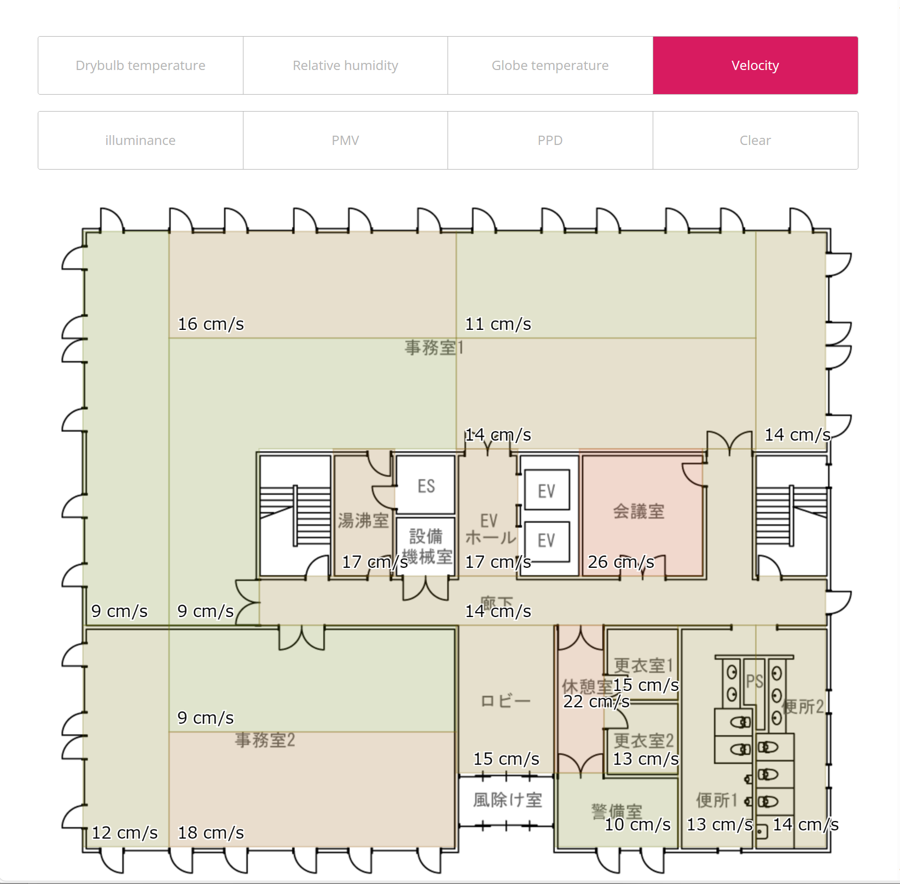

# 計測の開始とデータ

## M-Logger から送信を始める

MLServer を起動した状態で、スマートフォンアプリから M-Logger の計測を始めます。

- [計測の設定](../mobile/settings.md) の記録先で **PC** を選び、計測を開始します。以降、M-Logger は計測値を Zigbee で親機に送ります。
- 電池の交換などで電源を入れ直しても自動で計測を再開させたい場合は、[常設モード](../mobile/advanced.md#常設モードへの移行) にします。

MLServer が計測値を受け取ると、画面に受信した値が表示されます。

## 保存されるファイル

受け取った計測値は、M-Logger ごとに `data/<アドレス>.csv` に追記されます。`<アドレス>` は M-Logger の XBee アドレスの下位 8 桁 (例: `420266B3`) です。

| 列 | 内容 |
|---|---|
| Server Timestamp | MLServer が受信した日時 |
| Client Timestamp | M-Logger が計測した日時 (時刻が合っていない場合は `n/a`) |
| Drybulb temperature[C] | 乾球温度 [°C] |
| Relative humidity[%] | 相対湿度 [%] |
| Globe temperature[C] | グローブ温度 [°C] |
| Velocity[m/s] | 風速 [m/s] |
| Illuminance[lux] | 照度 [lx] |
| CO2 concentration[ppm] | CO2 濃度 [ppm] <span class="fw">v4 以降</span> |
| Voltage for velocity measurement[V] | 風速計の電圧 [V] |
| Future Placeholder | (予備) |
| Mean radiant temperature[C] | 平均放射温度 [°C] |
| WBGT (Indoor)[C] | WBGT (屋内) [°C] |
| WBGT (Outdoor)[C] | WBGT (屋外) [°C] |

計測していない項目や、その回に受け取れなかった項目は `n/a` になります。

## 時刻

MLServer は M-Logger の時計を自動で合わせます。電池の交換などで M-Logger の時計が合っていないときは、MLServer が受信した日時 (Server Timestamp) を計測日時とみなしてください。

## ブラウザでの表示

`data/index.htm` をブラウザで開くと、各 M-Logger の最新の計測値と、そこから計算した熱的快適性指標 (PMV、PPD、SET\*) の一覧が表示されます。一覧は 1 秒ごとに更新されます。表の右端のリンクから、M-Logger ごとの CSV をダウンロードできます。


ブラウザによっては、`index.htm` をファイルとして直接開くと表示が更新されないことがあります。その場合は、後述の Web サーバーで公開して開いてください。

最新の値は `data/latest.json` に書き出されており、一覧のページはこれを読み込んで表示しています。

### ヒートマップ

一覧のページでヒートマップ表示を有効にすると、平面図の上に計測値を色分けして表示できます。

{ width="600" }

使うには次の準備が必要です。

1. **背景の図**: 横幅 1000 px の PNG 画像を `data/background.png` として置きます。
2. **領域の割り当て**: `data/draw.js` の `drawRegion` に、M-Logger ごとに図の上の領域を書きます。座標は画像の左上を (0, 0) とし、右と下が正です。
    - 長方形: `rect(x0, y0, x1, y1)` (対角の 2 点)
    - 多角形: `beginShape();` と `endShape(CLOSE);` の間に頂点を `vertex(x, y);` で並べる

```javascript
function drawRegion(mloggerID){
  rectMode(CORNERS);
  switch(mloggerID){
    case "42114F57":            // M-Logger のアドレス (下位 8 桁)
      rect(55, 50, 160, 530);
      break;
    case "420BCCD1":
      beginShape();
      vertex(160,180);
      vertex(510,180);
      vertex(510,315);
      vertex(160,315);
      endShape(CLOSE);
      break;
  }
}
```

3. **色の範囲**: `data/config.js` で、色分けの上下限 (`max_tmp`、`min_tmp` など) や、自動で調整するか (`auto_color_range`) を設定します。

### 離れた場所から見る

`data` フォルダを Web サーバーで公開すると、離れた場所からブラウザで計測状況を確認できます。Web サーバーには、Raspberry Pi なら Apache などを使います。

```
# Apache の例 (/etc/apache2/sites-available/000-default.conf)
DocumentRoot /home/pi/MLServer/data
<Directory /home/pi/MLServer/data/>
    Options Indexes FollowSymLinks
    AllowOverride None
    Require all granted
</Directory>
```
