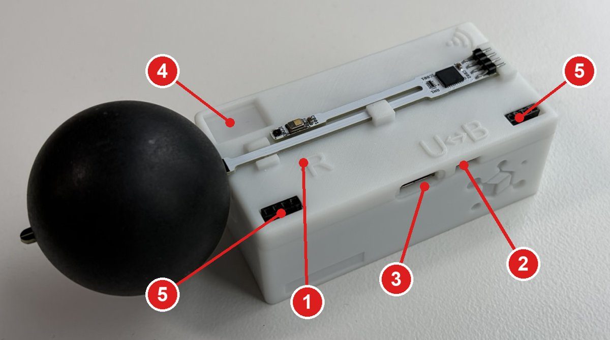

# 本体の基本操作

ソフトウェアの操作に関わる、本体側の操作と表示を説明します。仕様や校正については扱いません。

=== "v4 ファームウェア"

    ## 組み立て

    温湿度・CO2 プローブ (グローブ球付き) と風速プローブを、本体上面の 2 か所の差し込み口に挿します。2 つのプローブの差し込み口は共通なので、どちらに挿してもかまいません。

    { width="450" }

    ## 各部の名前

    { width="600" }

    | 番号 | 名前 | 内容 |
    |---|---|---|
    | 1 | Reset ボタン (`R` の左の小さな穴) | 長押しで常設モードを解除する。ファームウェアの更新にも使う |
    | 2 | 電源スイッチ (`U↔B`) | `U` 側で USB 給電、`B` 側で電池給電 |
    | 3 | USB Type-C | PC との通信と USB 給電 |
    | 4 | LED | 照度センサの拡散板を兼ねる |
    | 5 | プローブの差し込み口 | 温湿度・CO2 プローブ、風速プローブ用。どちらをどちらに挿してもよい |

    ## 電源

    電源スイッチは、USB 給電 (`U`) と電池給電 (`B`) を切り替えるスイッチです。

    - 電池で使うときは `B` 側にします。
    - USB で給電するときは `U` 側にし、USB ケーブルをつなぎます。

    電池を入れたまま USB ケーブルをつないでいると、スイッチをどちらにしても電源は切れません。電源を切りたいときは、使っていない側の電源 (電池または USB ケーブル) を外してください。

    ## 電池

    電池ボックスは本体の裏面にあります。単 3 形の電池を 2 本使います。

    - アルカリ乾電池のほか、充電式のニッケル水素電池も使えます。
    - 電池の電圧が下がると、計測を止めて赤 LED の点滅でお知らせします (下の表)。

    電池ボックスの蓋の裏には、風速プローブを差し込んで収納できます。風速を計測しないときや持ち運ぶときは、ここにしまってください。

    { width="500" }

    ## LED の表示

    | 表示 | 状態 |
    |---|---|
    | 緑が 1 秒ごとに点滅 | 待機中 (計測していない) |
    | 緑が 5 秒ごとに点滅 | 計測中 |
    | 赤が 1 秒ごとに点滅 | 記録データを転送中 (この間は他の操作を受け付けない) |
    | 緑と赤が 1 秒ごとに点滅 | CO2 センサの校正中 |
    | 赤が点灯 | Reset ボタンを押している |
    | 赤が 3 回点滅 | 常設モードを解除した (Reset ボタンの長押し)。または内蔵メモリがいっぱいで記録できない |
    | 赤が 3 秒ごとに 1 回点滅 | 電池の電圧が低い。電池を交換してください |
    | 赤が 3 秒ごとに 2 回点滅 | 無線モジュール (XBee) の異常 |

    ## Reset ボタン

    Reset ボタンは、`R` の刻印のすぐ左にある小さな穴の中にあります。クリップの先など細い棒を差し込んで押します。使う機会はほとんどないので、押しにくい場合は上蓋を外して押してもかまいません。

    - **3 秒以上長押し**: 常設モードを解除して再起動します。赤 LED が 3 回点滅します。
    - **押したまま電源を入れる**: ファームウェアを書き込む状態になります。[ファームウェアの更新](firmware_update.md) で使います。

=== "v3 ファームウェア"

    v3 の本体の操作は、[ハードウェア操作マニュアル (PDF)](https://mlogger.jp/ja/document_3.4.1.pdf) を参照してください。
