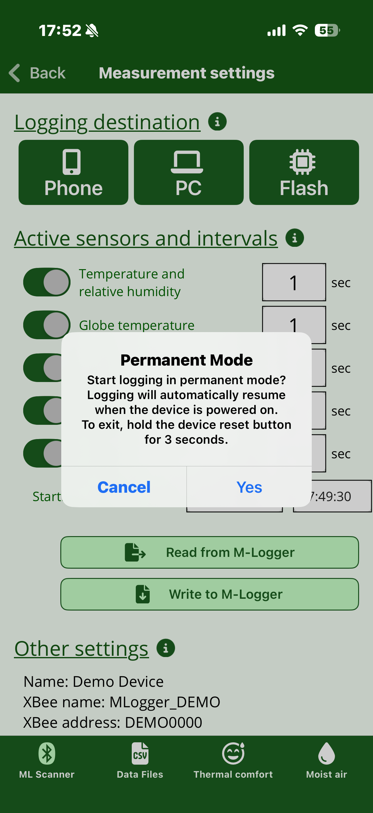

# Advanced settings and permanent mode

The items in this chapter are not used in normal measurement.
**Misconfiguring them may interfere with M-Logger operation.**

The three items "Correction coefficients" and "CO2 sensor calibration / initialization" only appear after you shake the smartphone on the [Measurement settings](settings.md) screen. The explicit shake gesture is the gate that protects them from accidental taps.

## Renaming the M-Logger

Use "Set M-Logger name" to change the display name shown in the scanner list.
Useful for distinguishing units when running several at once.

## Correction coefficients

Each unit is calibrated at the factory, so you normally do not need to touch this.
If you want to compensate for sensor drift after long-term use, the per-sensor gain and offset can be adjusted linearly.

## CO2 sensor calibration / initialization

The CO2 sensor has an **Automatic Self-Calibration (ASC)** feature: as long as it is exposed roughly once a day to fresh outdoor-equivalent air (about 400 ppm), it auto-calibrates against that level.
In normal indoor measurement — with daily ventilation, window opening, or carrying the device outdoors — ASC works without any special action.

For long-term measurement in continuously high CO2 environments (sealed rooms, greenhouses, experimental chambers, etc.) ASC never gets a chance to fire, and the output drifts away from the true value.
In that case, calibrate manually using one of the operations below.

### Calibrate CO2 Sensor

Place the sensor under a clearly known CO2 concentration, enter that value, and calibrate.

- The reference CO2 concentration should be a value verified with another calibrated CO2 meter or with a known reference gas
- The calibration operation takes about **30 seconds**. Keep the sensor and surrounding conditions (CO2 concentration, temperature, humidity, power) stable during that time

### Initialize CO2 Sensor

Resets the auto-calibration history that has accumulated during long-term measurement and re-anchors the sensor to a specified CO2 concentration.
Pressing this button performs a **24-hour stabilization measurement** and then resets the sensor to the specified CO2 concentration.

!!! note "Currently a custom procedure, not the manufacturer factory reset"
    The app's "Initialize CO2 Sensor" is not the literal factory-reset command of the CO2 sensor (Sensirion STCC4); it is a custom procedure that combines a 24-hour stabilization phase with the recalibration. A future update will align this with the manufacturer's factory-reset behaviour.

## Communication with PC

Used for multi-unit operation with PC + Zigbee.
In this topology the PC + XBee coordinator is the **parent**, and each M-Logger is a **child**.
For the concrete connection procedure and address assignment, see the PC operation manual (in preparation).

## Switching to permanent mode

{ width="280" }

Selecting "Switch to permanent mode" configures the M-Logger so that it automatically starts measurement and sends data to the PC every time it is powered on.
This mode is intended for fixed installations on walls, ceilings, and the like.

!!! warning "Cannot be cancelled from the smartphone"
    Once in permanent mode, the M-Logger stays in permanent mode through any power cycle. You must use the physical Reset switch as described in the next section.

### Exiting permanent mode

{ width="280" }

!!! warning "Photo is from the legacy hardware"
    The photo above shows the Reset switch position of the legacy hardware (v3.x). On the v4 hardware the position differs. The photo will be replaced once a v4 picture is available.

Press and hold the Reset switch on the unit for 3 seconds or more; permanent mode is cancelled and the LED blinks three times.
