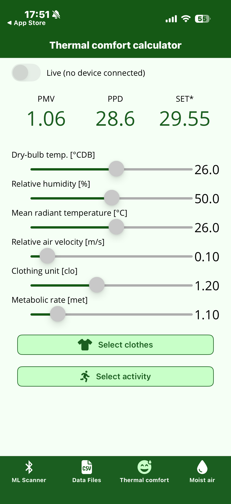
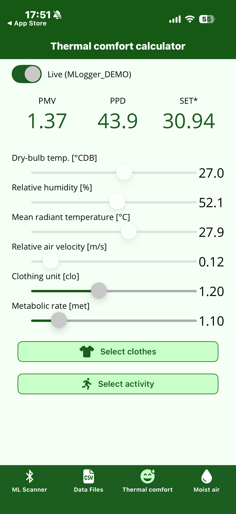
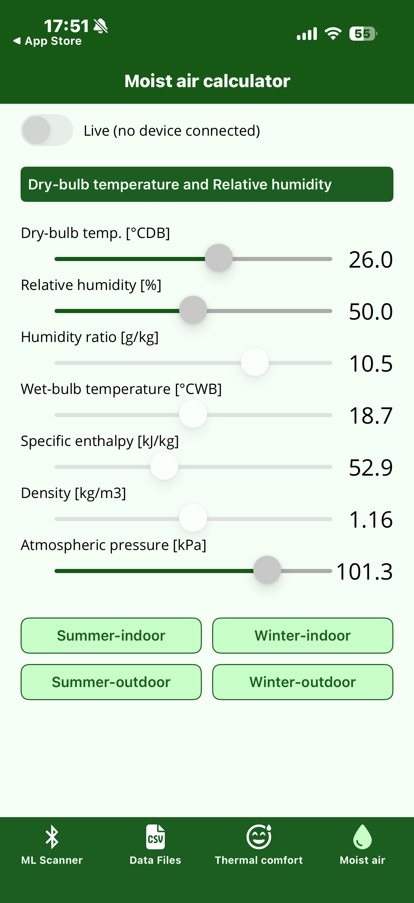
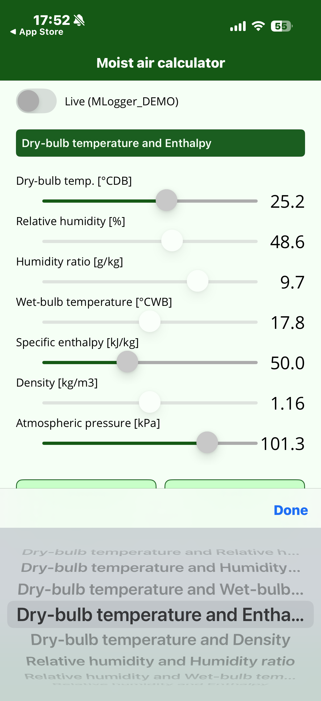
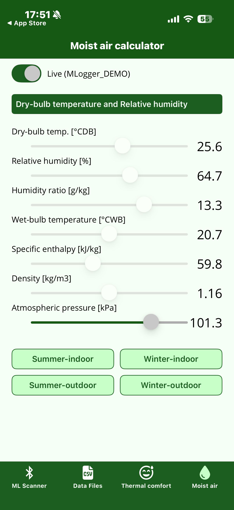

# Thermal comfort and moist air calculators

These calculators compute thermal-comfort indices and moist-air properties from input values, even without a connection to an M-Logger.
They are utilities for a quick "what would this condition feel like?" check on site, or for first-pass calculations during design work.

## Thermal comfort

{ width="280" }

Set the six inputs below with the sliders and PMV / PPD / SET\* are displayed in real time at the top of the screen.

| Input | Unit | Description |
|---|---|---|
| Dry-bulb temperature | °CDB | — |
| Relative humidity | % | — |
| Mean radiant temperature | °C | — |
| Relative air velocity | m/s | — |
| Clothing insulation | clo | 1 clo ≈ business-suit insulation (ASHRAE 55) |
| Metabolic rate | met | 1 met ≈ seated, quiet (58.2 W/m²) |

The three output indices mean:

- **PMV** (Predicted Mean Vote): predicted mean thermal sensation on a scale of –3 (cold) to +3 (hot) (ISO 7730)
- **PPD** (Predicted Percentage of Dissatisfied): the percentage of people who would report dissatisfaction under those conditions [%]
- **SET\*** (Standard Effective Temperature): the equivalent temperature mapped to a standard condition (50% RH, still air, 0.6 clo, 1 met) [°C]

Clothing and metabolic rate can be built up from concrete items via the buttons below, just like on the measurement screen (same as [Clothing and metabolic rate settings](logging.md#clothing-and-metabolic-rate-settings)).

### Live mode

{ width="280" }

Turning the **Live** toggle in the top-left ON auto-fills dry-bulb temperature, relative humidity, mean radiant temperature, and air velocity with the measured and computed values from the connected M-Logger (mean radiant temperature is the value computed on the M-Logger side).
The toggle is greyed out when no M-Logger is connected.

## Moist air

{ width="280" }

Given any two state variables, all remaining state variables are computed.

The state variables shown are:

| State variable | Unit | Description |
|---|---|---|
| Dry-bulb temperature | °CDB | — |
| Relative humidity | % | — |
| Humidity ratio | g/kg | — |
| Wet-bulb temperature | °CWB | — |
| Specific enthalpy | kJ/kg | — |
| Density | kg/m³ | — |
| Atmospheric pressure | kPa | Standard is 101.3 kPa |

The shortcuts at the bottom (Summer-indoor / Winter-indoor / Summer-outdoor / Winter-outdoor) load typical conditions in one tap.

### Switching the input pair

Tap the green header ("Dry-bulb temperature and Relative humidity") to change which two state variables are used as inputs.

{ width="280" }

The two you choose become inputs; the rest become computed outputs.
For example, choosing "Relative humidity and Humidity ratio" lets you back-solve the dry-bulb temperature from those two.

### Live mode

{ width="280" }

Like the thermal comfort calculator, turning the Live toggle ON pulls inputs from a connected M-Logger.
When the input pair is "Dry-bulb temperature and Relative humidity", enabling Live updates those two inputs automatically with the M-Logger values.
