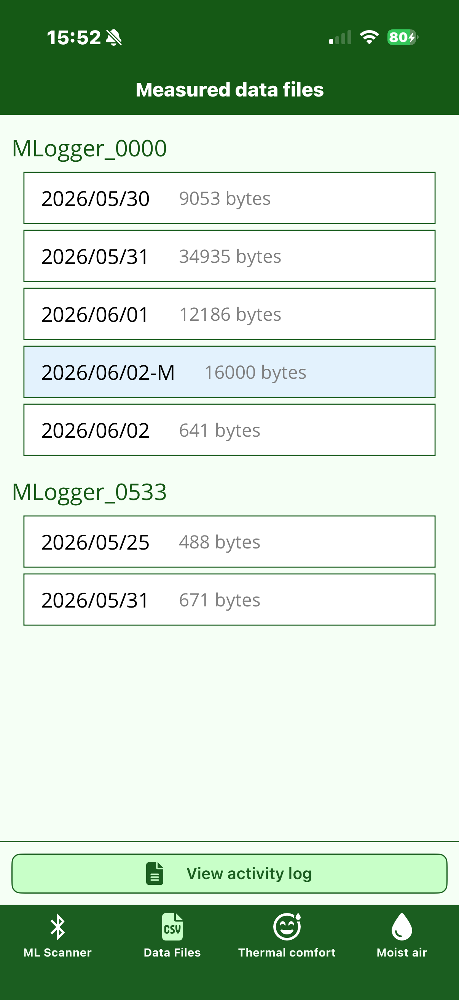
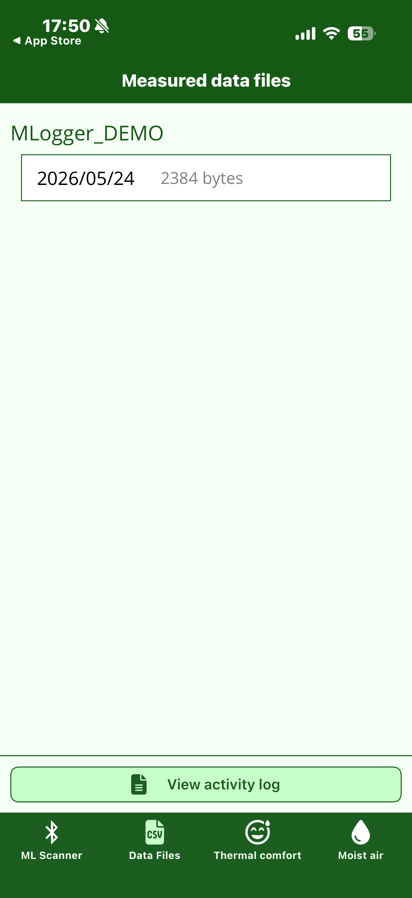
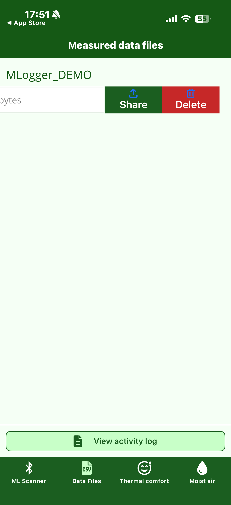
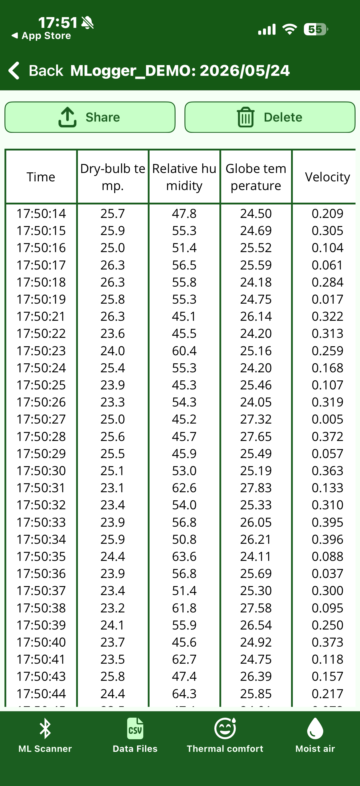
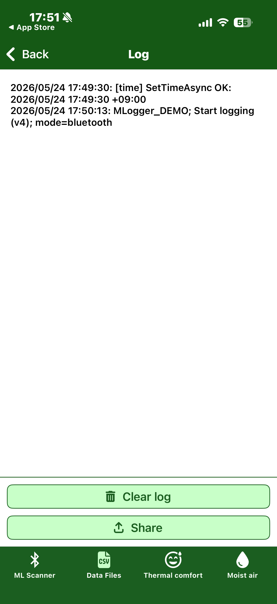

# Reviewing measured data

Past measurement data is managed under the **Data Files** tab.
The data is stored on the smartphone itself, so you can browse and share it without an internet connection.

## Data list

=== "v4 firmware (new)"

    { width="280" }

    Data is grouped by M-Logger, with each day's file listed below it together with
    its file size. If you measure more than once on the same day, the new data is
    appended to the file for that day.

    Rows marked with **`-M` suffix and a light-blue background** are records
    downloaded from the device's internal flash (i.e. measured first, then
    retrieved in bulk later). They are distinguished from data measured directly
    by the smartphone.

=== "v3 firmware (legacy)"

    { width="280" }

    Data is grouped by M-Logger, with each day's file listed below it together with
    its file size. If you measure more than once on the same day, the new data is
    appended to the file for that day.

## Sharing and deleting

Swipe a row to the left to reveal **Share** and **Delete** buttons.

{ width="280" }

- **Share**: send the file as CSV to another app (mail / messaging / cloud storage, etc.) via the OS standard share sheet.
- **Delete**: permanently delete the data. **Deletion cannot be undone**.

The CSV file contains one sample per row with timestamp and each sensor value. It opens directly in Excel or any analysis script.
CSV files measured directly on the phone and CSV files downloaded from the device (v4, `-M` suffix) share the same format, so analysis tools can treat them identically.

## Detail view

Tap a row to open the raw values of that measurement as a time-series table.

{ width="280" }

Use this when you want a quick look at the values on the smartphone.
For serious analysis the assumption is that you import the CSV into a PC.

## Viewing the device operation log

Tap "View activity log" at the bottom of the data list screen to open the communication history with the M-Logger.

{ width="280" }

Operations such as time sync, measurement start, and mode change are recorded with timestamps.
Useful when you want to trace the cause of unexpected behaviour.

The buttons at the bottom let you **Share** (send as text) and **Clear log**.
