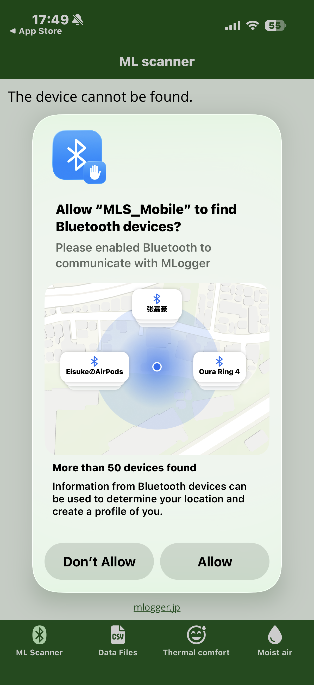
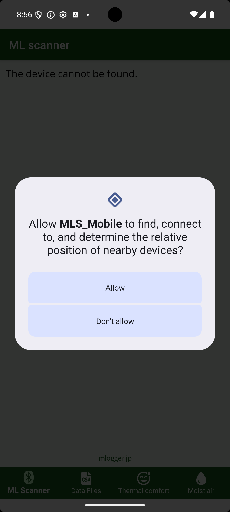
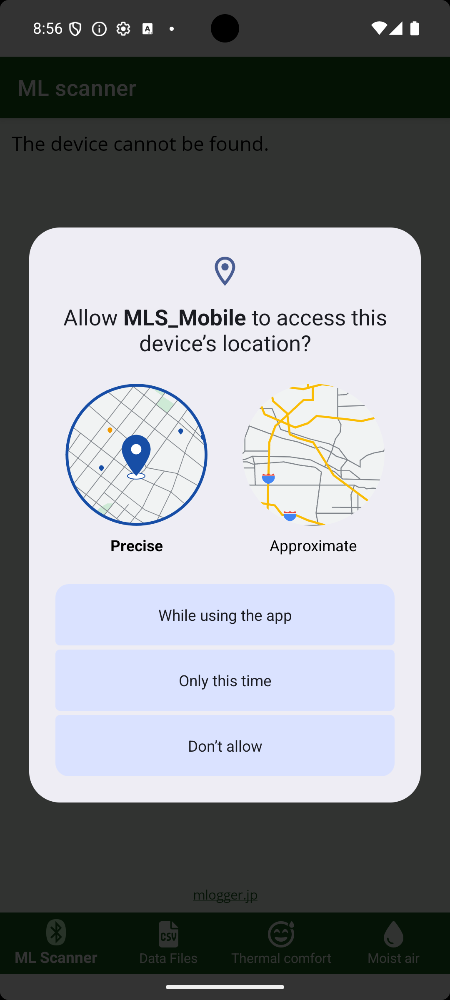

# Installation and first launch

## 1. Install the app

Install **MLogger Server** from the store that matches your OS.

| OS | Download |
|---|---|
| iPhone / iPad | [App Store](https://apps.apple.com/us/app/mlogger-server/id1599907037) |
| Android | [Google Play](https://play.google.com/store/apps/details?id=net.hvacsimulator.mls) |

## 2. Launch the app

Tap the MLogger Server icon on the home screen.
On the first launch, you will be asked to grant Bluetooth and/or location permissions.

### iPhone

Right after launch, the Bluetooth permission dialog appears.

{ width="280" }

Tap **Allow**. Without Bluetooth permission, the app cannot find any M-Logger.

### Android

On Android, two permissions are requested in sequence: "nearby devices" and "location".

First, the nearby-devices (Bluetooth) permission dialog appears.

{ width="280" }

Tap **Allow**. Without this permission, the app cannot find any M-Logger.

Next, the location permission dialog appears.

{ width="280" }

Choose **"While using the app"** with **"Precise"** location.

!!! note "Why is location permission required?"
    Android requires the location permission to scan for Bluetooth LE devices (for compatibility with Android 11 and earlier). The M-Logger app itself does not capture or store your location.

## 3. Changing permissions later

You can change permission choices later from the OS settings.

- **iPhone**: Settings → MLogger Server → Bluetooth
- **Android**: Settings → Apps → MLogger Server → Permissions
