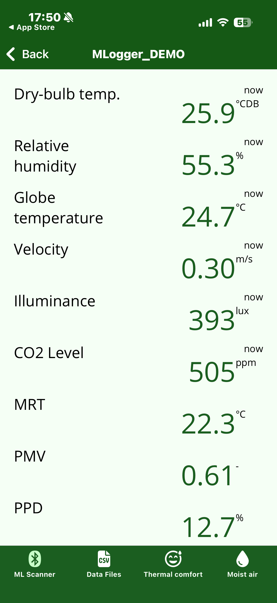
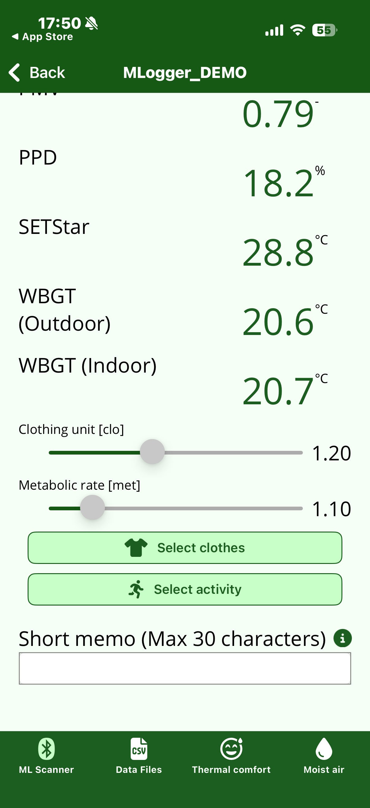
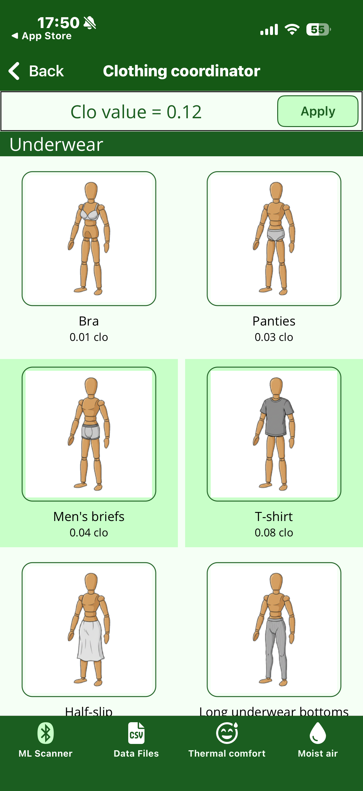
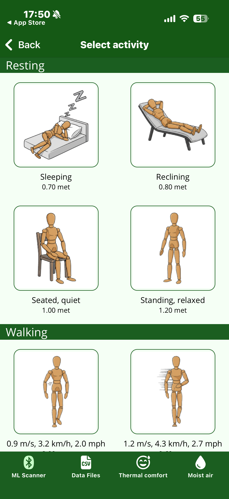

# During measurement

Once measurement starts, the screen switches to a real-time view of measured and calculated values.
While this screen is open, the smartphone is also receiving and recording the data stream from the M-Logger.

## Real-time values

{ width="280" }

The top half lists sensor readings received from the M-Logger together with thermal-environment indices derived from them.

| Row | Meaning | Unit |
|---|---|---|
| Dry-bulb temp. | — | °CDB |
| Relative humidity | — | % |
| Globe temperature | — | °C |
| Velocity | — | m/s |
| Illuminance | — | lux |
| CO2 Level | — | ppm |
| MRT | Mean radiant temperature, derived from globe temperature, air temperature, and air velocity | °C |
| PMV | Predicted Mean Vote (ISO 7730) | – |
| PPD | Predicted Percentage of Dissatisfied (ISO 7730) | % |
| SET\* | Standard Effective Temperature (ASHRAE 55) | °C |
| WBGT | Wet Bulb Globe Temperature; the formula differs between indoor and outdoor | °C |

!!! note "MRT / PMV / PPD / SET\* / WBGT are computed"
    These are not measured directly by sensors. They are computed from the raw values above (dry-bulb temperature, humidity, globe temperature, air velocity) together with the settings introduced below (clothing and metabolic rate).
    Missing any required input makes the computation impossible.

## Clothing and metabolic rate settings

{ width="280" }

PMV and SET\* require **clothing insulation (clo)** and **metabolic rate (met)**.
Set them directly with the sliders at the bottom of the screen, or use the buttons to build up a value from concrete items.

### Select clothes

{ width="280" }

Tap representative clothing items (underwear, tops, bottoms, outerwear, etc.) to sum up the total clo value.
**Apply** writes the result back to the clo slider on the measurement screen.

clo is a dimensionless quantity defined by ASHRAE 55 / ISO 7730; 1 clo is roughly the insulation of a business suit.

### Select activity

{ width="280" }

Choose a metabolic rate (met) from a list of activities following ASHRAE 55.
1 met corresponds to the metabolic rate of a seated, quiet person (≈ 58.2 W/m²).

## Short memo

The "Short memo" field accepts up to 30 characters and is saved together with the measurement data.
Use it for room name, subject, experimental condition, or any other marker that will help you when you review the data later.

## Ending the measurement

Press the Back button in the top-left corner to return to the previous screen; the measurement ends automatically.

!!! note "This screen is Phone mode only"
    This screen is shown only when the logging destination is **Phone**.
    Starting PC or Flash mode returns the app to ML Scanner immediately, and the M-Logger will not accept any Bluetooth connection until you cycle its power.
    To stop the measurement, turn off the M-Logger.
