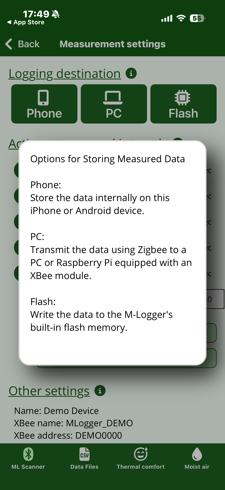

# Screen layout

The MLogger Server app exposes its features through four tabs at the bottom of the screen.
This chapter gives the big picture and explains UI elements shared across all screens.

## The four bottom tabs

| Tab | Role |
|---|---|
| **ML Scanner** | Find nearby M-Loggers over Bluetooth, connect, and start measurement |
| **Data Files** | Browse, view, share, and delete past measurement data |
| **Thermal comfort** | Compute thermal-comfort indices (PMV / PPD / SET\*) from input values |
| **Moist air** | Compute moist-air properties from input values |

ML Scanner and Data Files are tied to the physical M-Logger, while Thermal comfort and Moist air are standalone calculators that work without any M-Logger.
That said, the calculators have a **Live mode** that pulls input values from a connected M-Logger.

## (i) icons for detailed help

Each item heading on every screen has an **(i)** icon next to it.
Tapping it opens a popup explaining the meaning and caveats of that item.

{ width="280" }

This manual also covers everything found in those (i) popups in the main text of each chapter.
Treat the in-app (i) as a quick recall aid while you are on site, with this manual as the canonical reference.

## Back navigation

Every screen has a **Back** button in the top-left corner.
Pressing Back during an active measurement automatically ends the measurement (see [During measurement](logging.md)).
