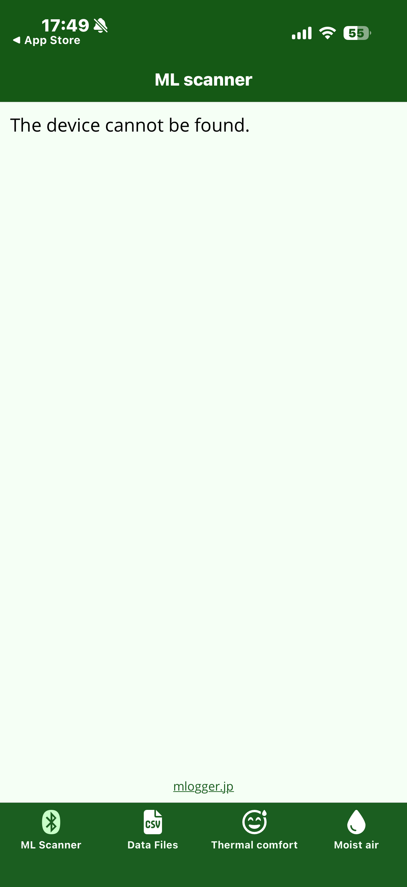
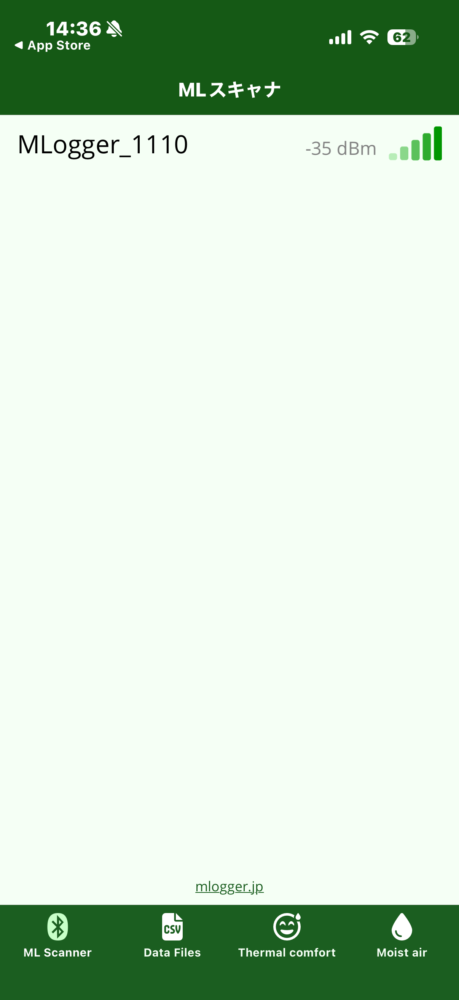

# Finding an M-Logger

Power on your M-Logger and look for it from the app's **ML Scanner** tab.

## 1. Power on the M-Logger

Turn on the power switch on the M-Logger. When it starts up correctly, the LED blinks green.

!!! tip "LED meanings"
    For LED blink patterns, see the [hardware operation manual (Japanese)](https://mlogger.jp/ja/document_3.4.1.pdf).

## 2. Open the ML Scanner tab

The ML Scanner tab is selected by default when the app launches.
If no M-Logger is powered on nearby, the list stays empty.

{ width="280" }

## 3. M-Loggers appear in the list

Right after you open the ML Scanner tab, and while you swipe down (pull-to-refresh) to rescan, any M-Logger that is detected is added to the list as soon as it is found.
After the scan finishes, powering on a new M-Logger does **not** add it automatically. Swipe down to rescan.

{ width="280" }

Each row shows:

- **Left**: M-Logger name (default is `MLogger_` followed by a 4-digit serial number)
- **Right**: signal strength (RSSI in dBm). Closer to `0 dBm` is stronger; closer to `-100 dBm` is weaker

## 4. Tap the M-Logger to connect

Tap the target M-Logger in the list to go to the measurement settings screen (next chapter).

If the connection fails, check the following:

- Is the M-Logger LED blinking green? (If not, the battery may be dead)
- Distance between the smartphone and the M-Logger (10 m recommended; metal walls weaken the signal)
- Is another smartphone or PC already connected to the same M-Logger? (M-Logger accepts only one connection at a time)
