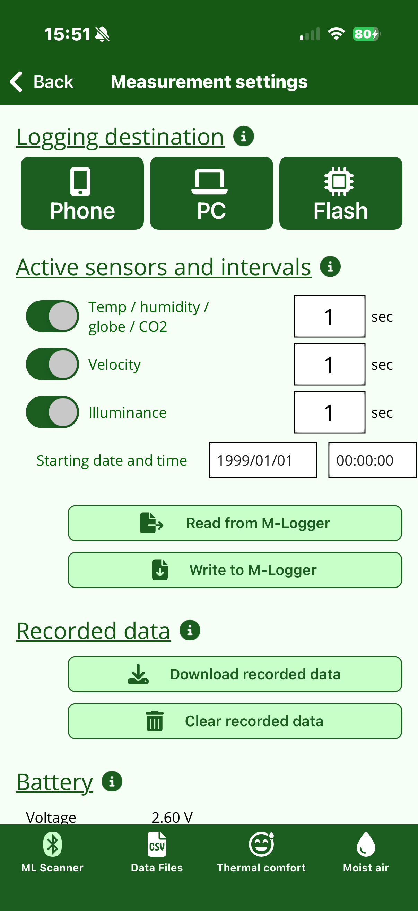
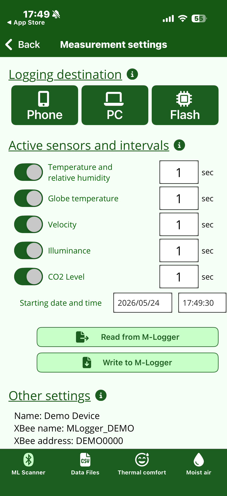
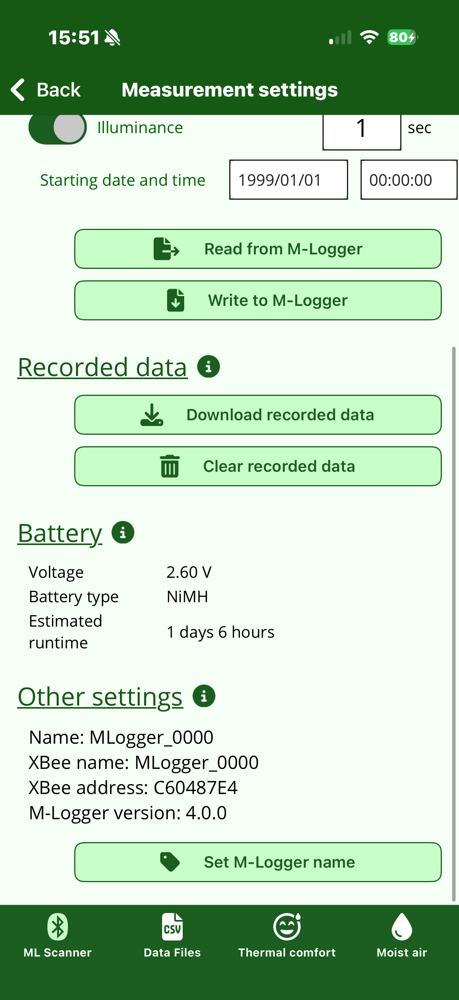
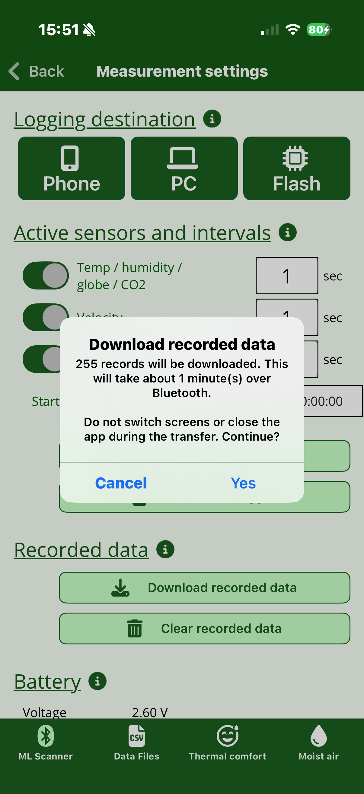
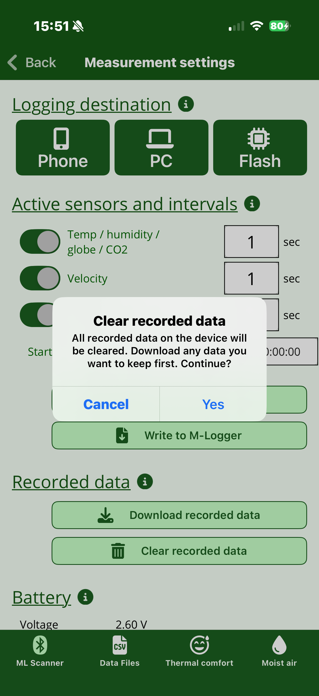
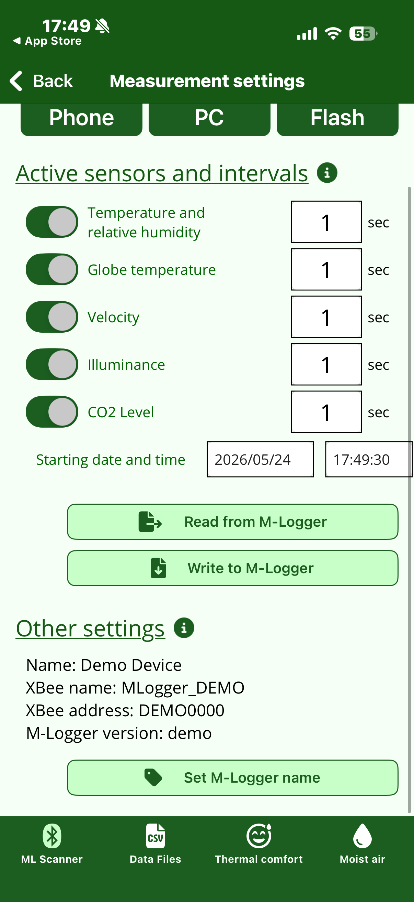
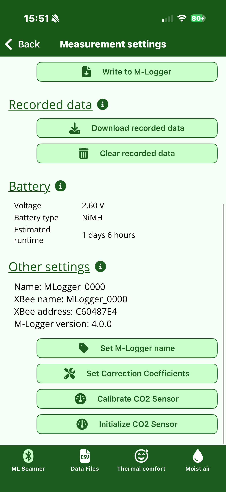
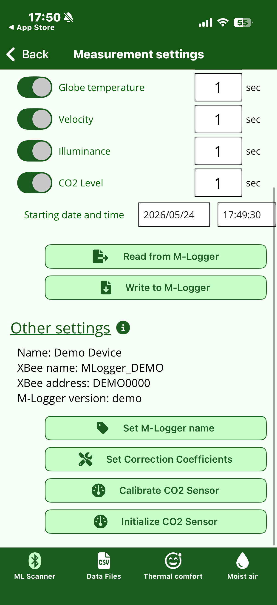

# Measurement settings

Selecting an M-Logger opens the **Measurement settings** screen.
On this screen you decide *what*, *where*, and *when* to record, then write the settings to the M-Logger.

!!! info "Screen layout differs between v3 and v4 firmware"
    The app UI switches automatically depending on the firmware version of your
    M-Logger. See [How to check your firmware version](index.md#which-firmware-version-is-on-your-m-logger) on the top page.
    Where the screen differs, both versions are shown in tabs below.

=== "v4 firmware (new)"

    { width="280" }

=== "v3 firmware (legacy)"

    { width="280" }

## Logging destination

Choose where measurement values are saved: Phone, PC, or Flash.

- **Phone**: saved incrementally on the smartphone during measurement. The easiest option.
- **PC**: received over PC + Zigbee and saved on the PC. Intended for multi-unit operation ([Advanced settings](advanced.md#communication-with-pc)).
- **Flash**: saved to the M-Logger's onboard flash memory. Allows long-term standalone operation with no smartphone or PC connection.

!!! note "Retrieval method differs between v3 and v4"
    - **v4** uses internal flash, so after a measurement the data can be retrieved either from the **smartphone (Bluetooth)** or from a **PC (USB Type-C)**. The Bluetooth path is described in [Recorded data](#recorded-data) below.
    - **v3** uses a removable memory card. After a measurement, physically remove the card from the body and read it on a PC with a card reader. Retrieval over smartphone or USB cable is not supported.

## Active sensors and intervals

Configure ON / OFF and the measurement interval (in seconds) for each item. Disabling unused items reduces power consumption and extends the internal battery life.

=== "v4 firmware (new)"

    Sensors are grouped into **three categories**. Sensors that share a single
    probe (and are read together) are exposed as a single setting to keep the UI compact.

    | Category | Sensors included |
    |---------|---------------|
    | **Temp / humidity / globe / CO2** | Drybulb temperature, relative humidity, globe temperature, CO2 (read together) |
    | **Velocity** | Air velocity |
    | **Illuminance** | Illuminance |

    Each category has independent ON / OFF and interval (seconds).

=== "v3 firmware (legacy)"

    Configure ON / OFF and interval independently for each of the **five sensors**:
    drybulb temperature & humidity, globe temperature, velocity, illuminance, and CO2.

## Starting date and time

If you specify a future date and time, the M-Logger waits until that moment and then starts measurement automatically.
Use this for scheduled measurements (e.g. "start at 9 a.m. tomorrow").

## Exchanging settings with the M-Logger

- **"Read from M-Logger"**: pulls the settings currently written on the M-Logger into the smartphone. Useful when you want to inspect or reuse the settings of an M-Logger already in service.
- **"Write to M-Logger"**: writes the edited settings to the M-Logger. **The M-Logger does not pick up the changes until you write them**.

## Recorded data

!!! note "v4 firmware only"
    This section is only shown on v4 firmware. On v3 firmware, retrieval is done
    by physically removing the memory card from the body and reading it on a PC
    with a card reader.

Download or clear the data recorded in the device's internal flash.

{ width="280" }

### Download recorded data

Tap "Download recorded data" to show a confirmation dialog with the record count and estimated transfer time.

{ width="280" }

- **Transfer takes time** over Bluetooth (effective throughput ~2 KB/sec). Around 1–2 minutes for 10,000 records, about 5–6 minutes for a month of data (60-sec interval × 1 month ≈ 43,000 records)
- The screen is blocked during the transfer (do not close the app or switch tabs)
- The body's **red LED blinks during the transfer** to indicate that other operations are unavailable
- The retrieved CSV is saved under the [Data Files tab](data.md) marked with **`-M` suffix and a light-blue background** for easy identification

### Clear recorded data

Tap "Clear recorded data" to delete all records on the device and free up space for new measurements.

{ width="280" }

!!! warning "Cleared data cannot be recovered"
    Download any data you want to keep before clearing.

The device automatically stops recording when the internal flash is full (about 1.4 million records). Periodically downloading and clearing keeps capacity available for new measurements.

## Battery

!!! note "v4 firmware only"
    This section is only shown on v4 firmware.

{ width="280" }

- **Voltage**: VBAT read when this screen opens
- **Battery type**: estimated from the initial voltage (assuming fresh cells). A mismatch with the cells you actually inserted may indicate non-fresh or defective cells
- **Estimated runtime**: estimated continuous-measurement time using a fresh 2000 mAh battery for the current settings. The wind sensor dominates power consumption, so increasing the velocity interval extends the runtime the most

This is a reference value. Actual runtime varies by about ±30% depending on temperature, self-discharge, and individual cell variation.

## Other settings

=== "v4 firmware (new)"

    { width="280" }

=== "v3 firmware (legacy)"

    { width="280" }

In the normal state, the "Other settings" section at the bottom of the screen shows:

- Name, XBee Name, XBee address, firmware version (read-only display)
- **Set M-Logger name**: change the display name of the M-Logger

This is all you need for regular measurement; the advanced settings below are intentionally hidden.

## Shake to reveal advanced settings

Shake the smartphone **once** (one short back-and-forth) to reveal extra buttons in the "Other settings" section.
**Shake once more** to hide them again.

=== "v4 firmware (new)"

    { width="280" }

=== "v3 firmware (legacy)"

    { width="280" }

- **Set Correction Coefficients**
- **Calibrate CO2 Sensor**
- **Initialize CO2 Sensor**

These can change the M-Logger's behaviour if set incorrectly, so they are hidden from the normal menu.
The shake gesture acts as an explicit gate so that you only reach them deliberately.

See [Advanced settings and permanent mode](advanced.md) for the meaning and usage of each item.

## Starting the measurement

After writing the settings to the M-Logger, start the measurement with the button matching your logging destination.

- Logging destination **Phone**: tap "Record to Smartphone" → the [During measurement](logging.md) screen opens; press Back to end.
- Logging destination **Flash**: tap "Record in Flash mode" → as soon as you press the start button, the app returns to ML Scanner and the M-Logger continues to measure on its own. **The M-Logger will not accept any Bluetooth connection until you cycle its power** (on v4 firmware, you can download after stopping the measurement).
- Logging destination **PC**: tap "Send to PC" → like Flash, the app returns to ML Scanner immediately. Subsequent data reception is handled on the PC + Zigbee side.
