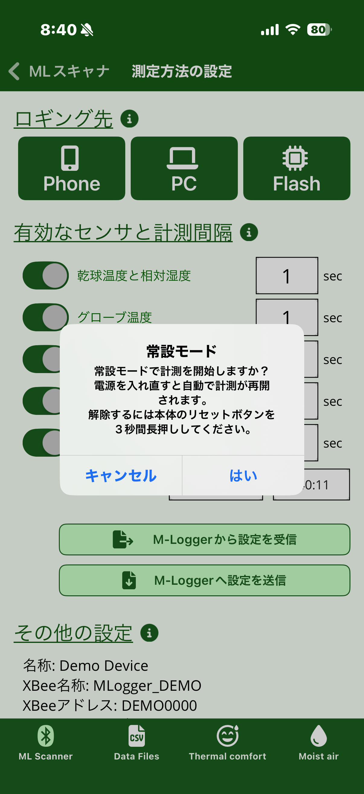
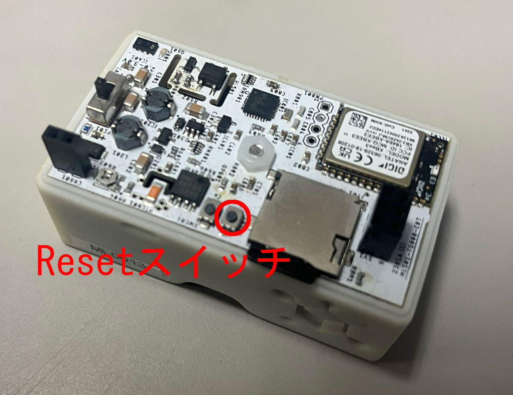

# 詳細設定と常設モード

ここで扱う項目は通常の計測では使いません。
**設定を誤ると M-Logger の動作に支障が出る可能性があります**。

このうち「補正係数」「CO2 センサの校正・初期化」の 3 つは [計測の設定](settings.md) 画面でスマートフォンをシェイクしたときだけ表示されます。誤操作を防ぐため、シェイクという明示的な動作を介して初めて開放されるようになっています。

## M-Logger 名の変更

「M-Logger の名称を設定」から、スキャナ画面のリストに表示される名前を変更できます。
複数台運用する際の識別に使います。

## 補正係数

工場出荷時にキャリブレーション済みのため通常は触る必要はありません。
長期使用後にセンサ出力のドリフトを補正したい場合に、各センサごとの倍率・オフセットを線形に調整できます。

## CO2 センサの校正・初期化

CO2 センサには **自動自己校正 (ASC)** 機能があり、1 日に 1 回程度、屋外相当 (約 400 ppm) の新鮮空気に触れさせていれば、その濃度を基準に自動で校正されます。
通常の屋内計測でも、毎日窓開け・換気・屋外への持ち出しなどがあれば自動校正は機能するため、特別な操作は不要です。

長期間にわたって高 CO2 濃度の環境 (締め切った室内・温室・実験チャンバなど) で計測を続けた場合、自動校正のチャンスがないため出力が実際の値からずれていきます。
この場合に、以下の手動操作で校正します。

### CO2 センサを校正する

明確に分かっている CO2 濃度の下にセンサを置き、その濃度を入力して校正します。

- 入力する CO2 濃度は、別の校正済み CO2 計または既知のガスで確認した値を使います
- 校正動作には約 **30 秒** の時間が必要です。その間、センサと周囲条件 (CO2 濃度・温度・湿度・電源) を安定させたまま放置してください

### CO2 センサを初期化する

長期計測中の積み上がった自動校正履歴をリセットし、改めて指定 CO2 濃度を基準値として書き直す操作です。
このボタンを押すと **24 時間の安定化計測** ののち、指定 CO2 濃度へリセットされます。

!!! note "現状はメーカー仕様とは異なる独自実装"
    本アプリの「CO2 センサを初期化する」は、CO2 センサ (Sensirion STCC4) の工場リセットコマンドそのものではなく、24 時間の安定化計測を組み合わせた独自手順です。今後のアップデートでメーカー仕様の工場リセット動作に合わせていく予定です。

## PC との通信

PC + Zigbee で複数台同時運用する場合に使います。
このとき PC + XBee コーディネータが **親機**、各 M-Logger が **子機** となります。
具体的な接続手順とアドレス割り当ては PC 運用マニュアル (準備中) を参照してください。

## 常設モードへの移行

{ width="280" }

「常設モードへ移行」を選ぶと、M-Logger の電源を入れるたびに自動で計測を開始し、PC へデータ送信する設定になります。
壁面・天井等への据付運用を想定したモードです。

!!! warning "解除はスマートフォンからはできません"
    一度常設モードに移行すると、電源 OFF / ON でも解除されません。次節の Reset スイッチによる物理操作が必要です。

### 常設モードの解除

{ width="280" }

!!! warning "画像は旧版"
    上記写真は旧ハードウェア (v3.x) の Reset スイッチ位置です。v4 ハードでは位置が異なります。撮影でき次第差し替えます。

本体の Reset スイッチを 3 秒以上長押しすると、常設モードが解除されて LED が 3 回点滅します。
