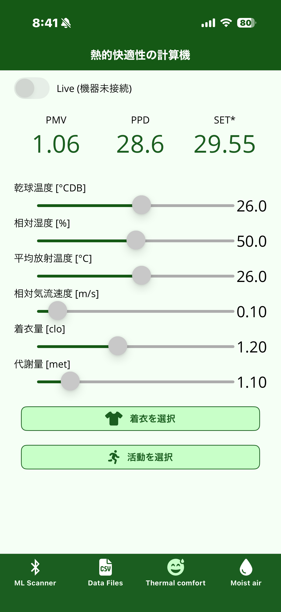
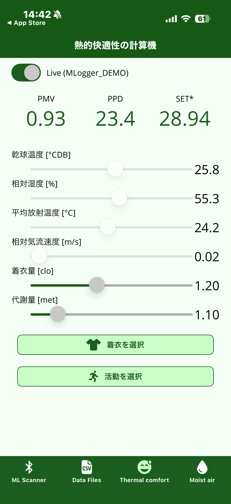
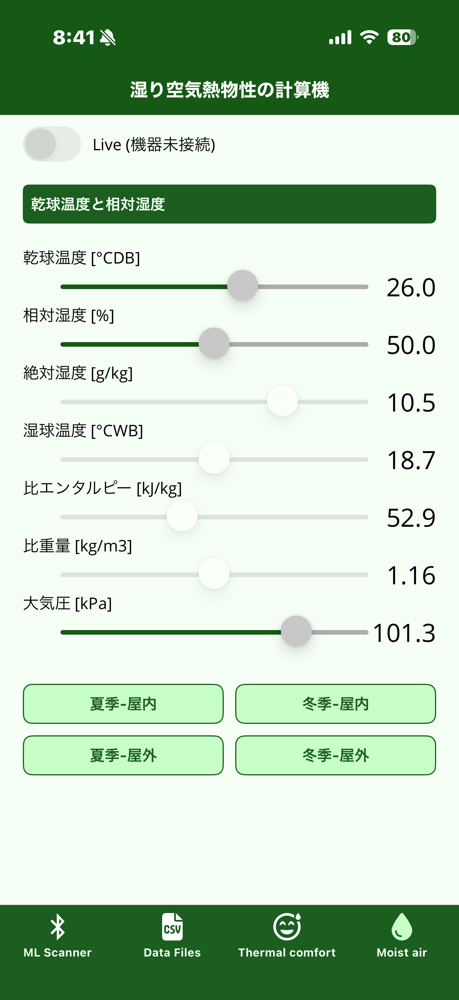
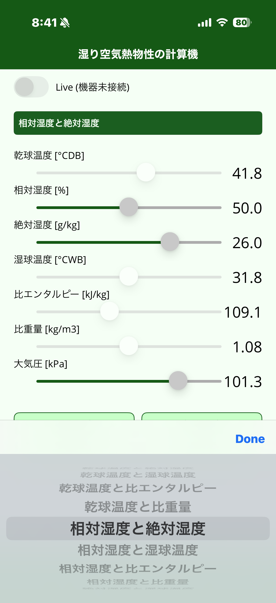
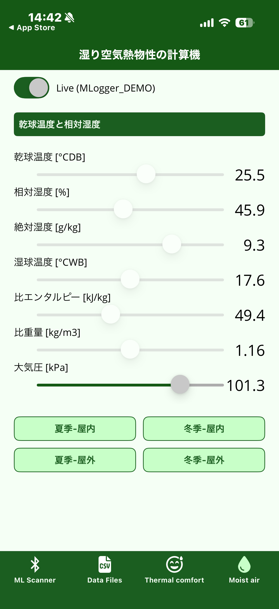

# 熱的快適性・湿り空気の計算

M-Logger と接続していなくても、入力値から熱的快適性指標と湿り空気物性を計算できます。
計測現場で「今のこの条件ではどう感じるか」を素早く検討する、あるいは設計検討時の試算に使うためのユーティリティです。

## 熱的快適性 (Thermal comfort)

{ width="280" }

スライダーで以下の 6 入力を与えると、PMV / PPD / SET\* が画面上部にリアルタイム表示されます。

| 入力 | 単位 | 説明 |
|---|---|---|
| 乾球温度 | °CDB | — |
| 相対湿度 | % | — |
| 平均放射温度 | °C | — |
| 相対気流速度 | m/s | — |
| 着衣量 | clo | 1 clo ≒ スーツ程度の保温力 (ASHRAE 55) |
| 代謝量 | met | 1 met ≒ 座位安静時 (58.2 W/m²) |

出力される 3 指標の意味は以下の通りです。

- **PMV** (Predicted Mean Vote): –3 (寒い) ～ +3 (暑い) のスケールで予測平均温冷感を示す (ISO 7730)
- **PPD** (Predicted Percentage of Dissatisfied): 上記条件下で「不満」と申告する人の割合 [%]
- **SET\*** (Standard Effective Temperature): 標準条件 (50% RH, 静穏, 0.6 clo, 1 met) に換算した等価温度 [°C]

着衣量と代謝量は計測画面と同様に、下のボタンから具体的に積み上げ計算できます ([着衣を選択 / 活動を選択](logging.md#着衣量と代謝量の設定) と同じ機能)。

### Live モード

{ width="280" }

画面左上の **Live** トグルを ON にすると、接続中の M-Logger の計測値および計算値が乾球温度・相対湿度・平均放射温度・気流速度に自動入力されます (平均放射温度は M-Logger 側で算出した値)。
M-Logger 未接続時はトグルがグレーアウトされます。

## 湿り空気 (Moist air)

{ width="280" }

任意の 2 つの状態量を与えると、残りすべての状態量を計算します。

表示される状態量は以下の通りです。

| 状態量 | 単位 | 説明 |
|---|---|---|
| 乾球温度 | °CDB | — |
| 相対湿度 | % | — |
| 絶対湿度 | g/kg | — |
| 湿球温度 | °CWB | — |
| 比エンタルピー | kJ/kg | — |
| 比重量 | kg/m³ | — |
| 大気圧 | kPa | 標準は 101.3 kPa |

下部のショートカット (夏季-屋内 / 冬季-屋内 / 夏季-屋外 / 冬季-屋外) で典型条件を一発入力できます。

### 入力組合せの切替

ヘッダー (上部の緑帯) の「乾球温度と相対湿度」をタップすると、入力に使う 2 状態量の組合せを変更できます。

{ width="280" }

選んだ 2 つが入力となり、残りは計算結果になります。
例えば「相対湿度と絶対湿度」を選ぶと、その 2 つから乾球温度等を逆算できます。

### Live モード

{ width="280" }

熱的快適性と同様、Live トグルを ON にすると接続中の M-Logger の計測値を入力に使えます。
入力組合せが「乾球温度と相対湿度」のときに Live を有効化すると、その 2 入力が M-Logger 由来の値で自動更新されます。
