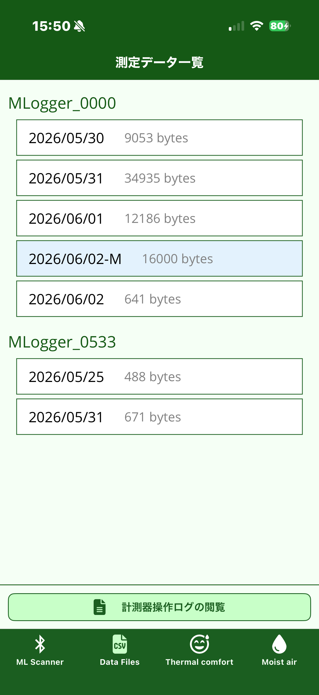
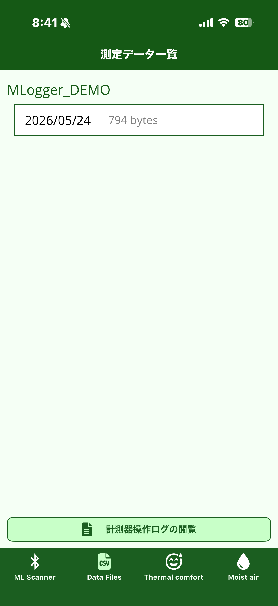
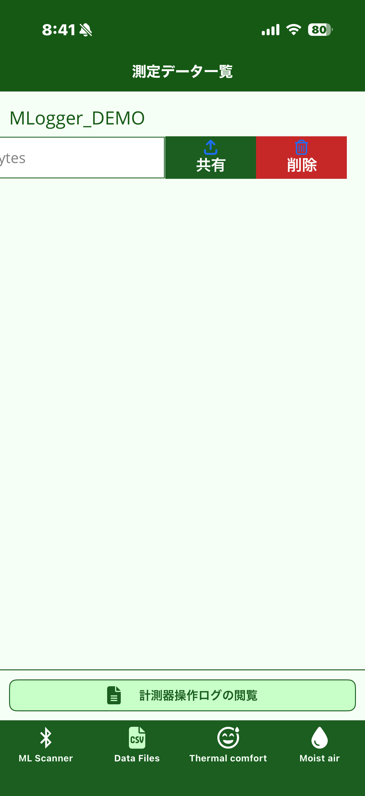
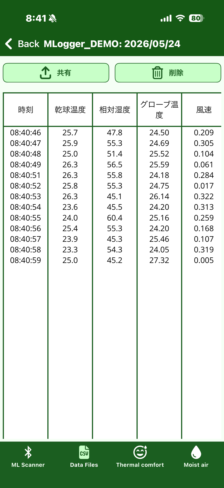
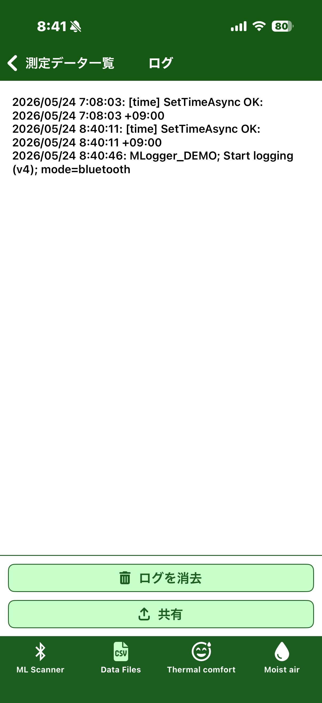

# 計測データの確認

これまでに計測したデータは **Data Files** タブで管理します。
スマートフォン本体に保存されているため、ネット接続がなくても閲覧・共有できます。

## データ一覧

=== "v4 ファームウェア (新型)"

    { width="280" }

    M-Logger 別にグループ化されて、その下に日付ごとのデータがファイルサイズ付きで並びます。
    1 日に複数回計測した場合は、同じ日付のファイルに追記されます。

    **`-M` マーカー + 淡 blue 背景** の行は、機器の内蔵フラッシュからダウンロードした
    記録 (= 計測 → 後でまとめて取得) を示します。スマートフォンで直接計測したデータ
    と区別できます。

=== "v3 ファームウェア (従来型)"

    { width="280" }

    M-Logger 別にグループ化されて、その下に日付ごとのデータがファイルサイズ付きで並びます。
    1 日に複数回計測した場合は、同じ日付のファイルに追記されます。

## 共有・削除

行を左にスワイプすると **共有** と **削除** のボタンが現れます。

{ width="280" }

- **共有**: CSV ファイルとして他アプリ (メール / メッセージ / クラウドストレージ など) へ送信できます。OS 標準の共有メニューが開きます。
- **削除**: そのデータを完全に削除します。**削除すると元に戻せません**。

CSV ファイルには時刻と各センサ値が 1 行 1 サンプルで記録されています。Excel や解析スクリプトでそのまま読み込めます。
スマホで直接計測した CSV と、機器からダウンロードした CSV (v4 の `-M` 付き) は同じフォーマットなので、解析側で区別なく扱えます。

## 詳細表示

行をタップすると、その計測の生値が時系列の表で表示されます。

{ width="280" }

スマートフォン上で簡単に値を確認したいときに使います。
本格的な解析は CSV を PC に取り込んで行うことを想定しています。

## 計測器操作ログの閲覧

データ一覧画面下部の「計測器操作ログの閲覧」をタップすると、M-Logger との通信履歴が表示されます。

{ width="280" }

M-Logger への時刻同期・計測開始・モード切替などの操作が時刻付きで残っています。
意図しない動作の原因を追跡したいときに役立ちます。

下部のボタンで **共有** (テキストとして送信) と **ログを消去** が可能です。
