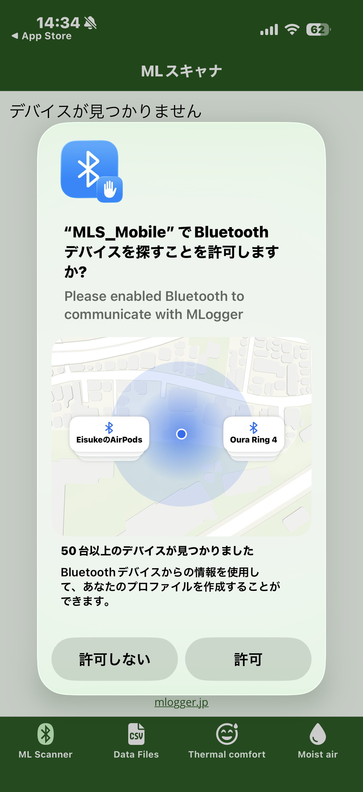
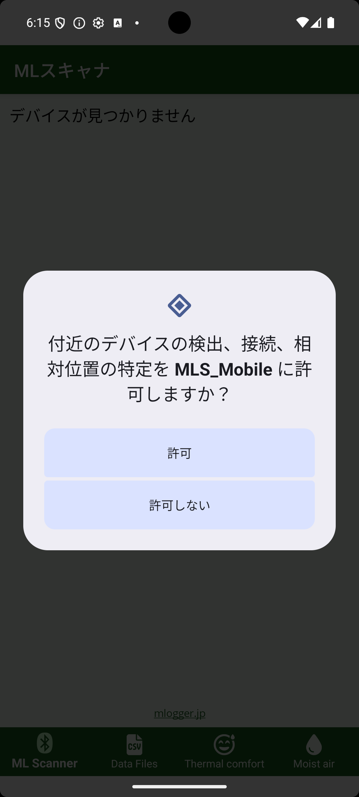
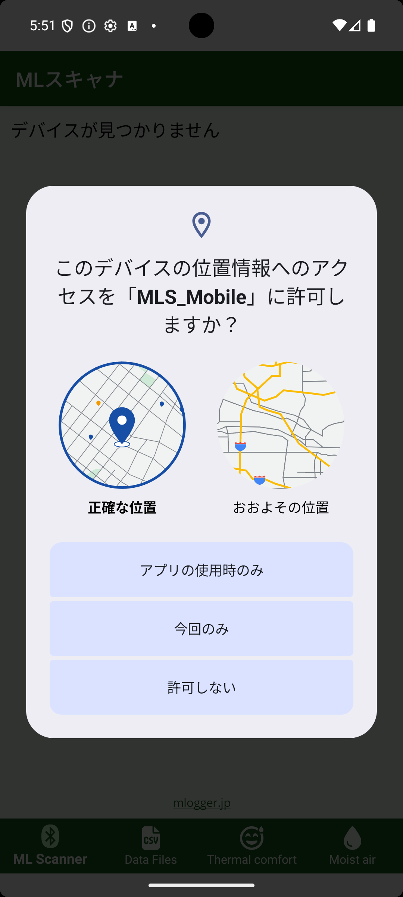

# インストールと初回起動

## 1. アプリをインストールする

スマートフォンの OS に応じて、以下のストアから **MLogger Server** をインストールします。

| OS | ダウンロード先 |
|---|---|
| iPhone / iPad | [App Store](https://apps.apple.com/us/app/mlogger-server/id1599907037) |
| Android | [Google Play](https://play.google.com/store/apps/details?id=net.hvacsimulator.mls) |

## 2. アプリを起動する

ホーム画面の MLogger Server アイコンをタップして起動します。
初回起動時、Bluetooth または位置情報の使用許可を求めるダイアログが表示されます。

### iPhone の場合

起動直後に Bluetooth の許可が求められます。

{ width="280" }

**「許可」** をタップしてください。Bluetooth を許可しないと、M-Logger を見つけることができません。

### Android の場合

Android では「付近のデバイス」と「位置情報」の 2 つの権限が順に求められます。

まず付近のデバイス (Bluetooth) の権限ダイアログが表示されます。

{ width="280" }

**「許可」** をタップしてください。これを許可しないと M-Logger を見つけることができません。

続いて位置情報の権限ダイアログが表示されます。

{ width="280" }

**「アプリの使用時のみ」 + 「正確な位置」** を選んでください。

!!! note "なぜ位置情報の許可が必要なのか?"
    Android では Bluetooth LE デバイスのスキャンに位置情報の権限が必要とされています (Android 11 以前との互換性のため)。M-Logger アプリは位置情報そのものを取得・保存することはありません。

## 3. 権限を後から変更する

権限の選択を後で変えたい場合は、OS の設定画面から変更できます。

- **iPhone**: 設定 → MLogger Server → Bluetooth
- **Android**: 設定 → アプリ → MLogger Server → 権限
