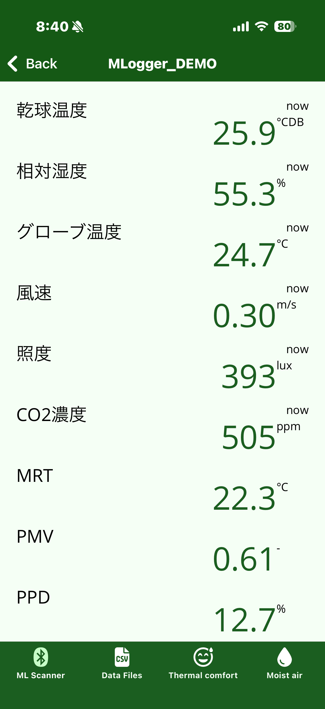
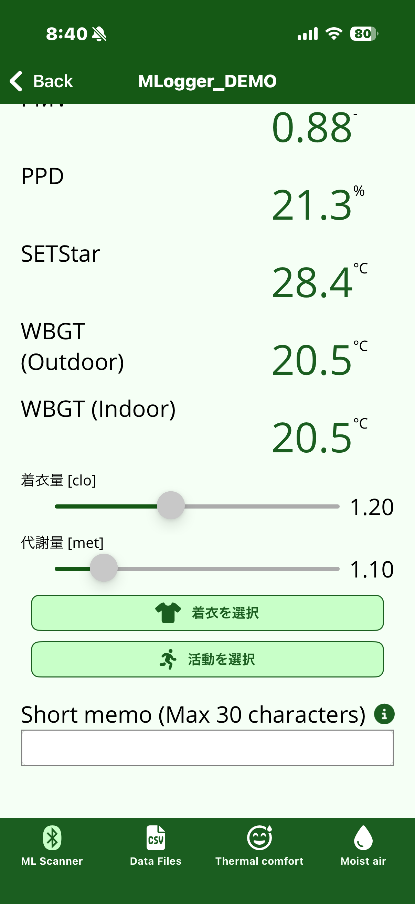
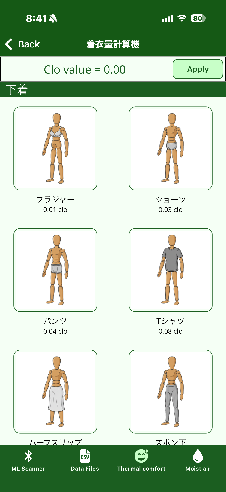
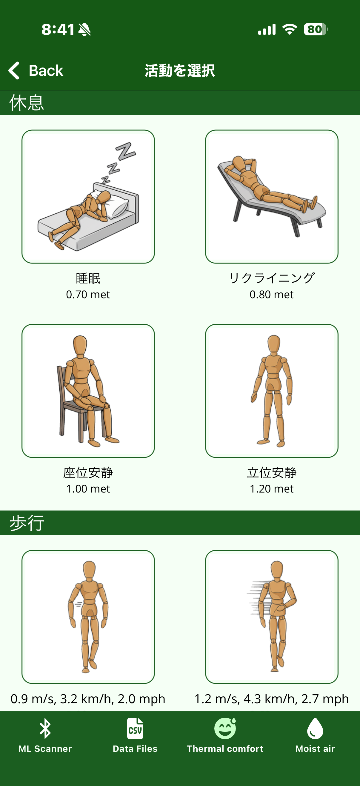

# 計測中の表示

計測を開始すると、リアルタイムの計測値と算出値を表示する画面に切り替わります。
この画面が表示されている間、M-Logger からのデータをスマートフォン側でも逐次受信・記録しています。

## リアルタイム計測値

{ width="280" }

上半分には M-Logger から受信したセンサ値と、それらから算出した熱環境指標が並びます。

| 行 | 意味 | 単位 |
|---|---|---|
| 乾球温度 | — | °CDB |
| 相対湿度 | — | % |
| グローブ温度 | — | °C |
| 風速 | — | m/s |
| 照度 | — | lux |
| CO2 濃度 | — | ppm |
| MRT | 平均放射温度。グローブ温度・気温・風速から算出 | °C |
| PMV | 予測平均温冷感申告 (ISO 7730) | – |
| PPD | 予測不満足者率 (ISO 7730) | % |
| SET\* | 標準新有効温度 (ASHRAE 55) | °C |
| WBGT | 暑さ指数。屋内 / 屋外で算出式が異なる | °C |

!!! note "MRT / PMV / PPD / SET\* / WBGT は計算値"
    これらはセンサで直接測ったものではなく、上記の生値 (乾球温度・湿度・グローブ温度・風速) と、後述する設定値 (着衣量・代謝量) から計算しています。
    必要な入力のいずれかが欠けると算出できません。

## 着衣量と代謝量の設定

{ width="280" }

PMV と SET\* の計算には **着衣量 (clo)** と **代謝量 (met)** が必要です。
画面下部のスライダーで直接指定するか、ボタンから具体的に積み上げ計算できます。

### 着衣を選択

{ width="280" }

代表的な衣服アイテム (下着・トップス・ボトムス・上着 など) をタップして合計 clo 値を求められます。
**Apply** で計測画面側の clo スライダーに反映されます。

clo は ASHRAE 55 / ISO 7730 で定義される無次元量で、1 clo ≒ スーツ程度の保温力を意味します。

### 活動を選択

{ width="280" }

ASHRAE 55 に準拠した活動別の代謝量 (met) を選択できます。
1 met は座位安静時の代謝率 (≒ 58.2 W/m²) に相当します。

## メモの記入

「Short memo」に最大 30 文字のメモを入れると、計測データに紐付いて保存されます。
室名・対象者・実験条件など、後でデータを見直すときの目印に使います。

## 計測の終了

画面左上の Back ボタンで前画面に戻ると、計測は自動で終了します。

!!! note "この画面は Phone モードのみ"
    本章の画面が表示されるのは、ロギング先が **Phone** のときだけです。
    PC / Flash モードを開始するとアプリは即座に ML Scanner 画面へ戻り、以降は M-Logger の電源を切るまで Bluetooth 接続を受け付けません。
    計測を止めるには M-Logger 本体の電源を切ってください。
