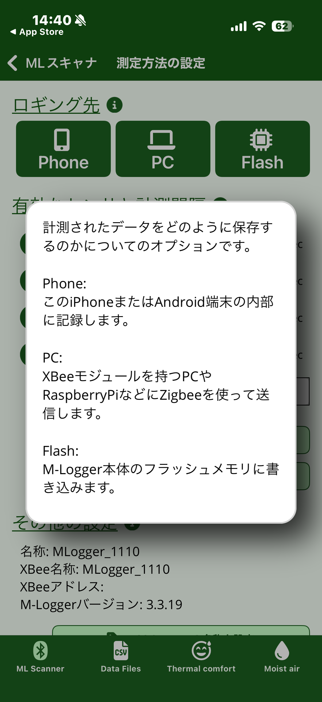

# 画面の構成

MLogger Server アプリは、画面下部の 4 つのタブで機能を切り替えます。
ここでは全体像と、各画面に共通する操作を説明します。

## 画面下部の 4 つのタブ

| タブ | 役割 |
|---|---|
| **ML Scanner** | 近くにある M-Logger を Bluetooth で探し、接続して計測を開始する |
| **Data Files** | 過去に計測したデータを一覧・閲覧・共有・削除する |
| **Thermal comfort** | 入力値から熱的快適性指標 (PMV/PPD/SET\*) を計算する |
| **Moist air** | 入力値から湿り空気の物性値を計算する |

ML Scanner と Data Files は M-Logger 本体と関連する画面で、Thermal comfort と Moist air は M-Logger に接続しなくても単独で使える計算機です。
ただし計算機側でも「Live モード」を有効にすると、接続中の M-Logger の計測値を自動入力に使えます。

## (i) アイコンによる詳細説明

各画面の項目見出しの横に **(i)** アイコンが置かれています。
タップすると、その項目の意味と注意点がポップアップで表示されます。

{ width="280" }

本マニュアルでは (i) で扱われている内容も各章の本文中に一通り解説しています。
アプリ側の (i) は、計測現場でその場で内容を思い出すための補助とお考えください。

## 戻る操作

各画面の左上には **Back** ボタンがあります。
計測中の画面で Back を押すと、計測は自動的に終了します ([計測中の表示](logging.md) を参照)。
