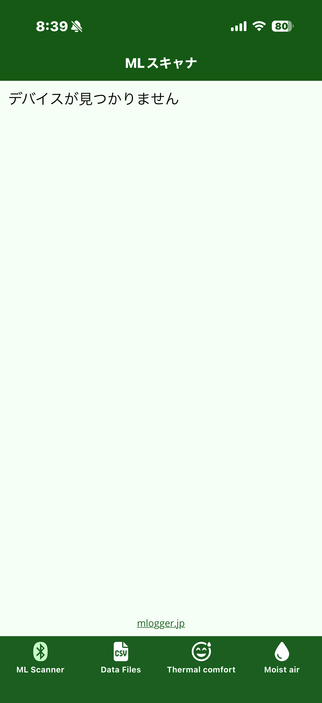

# M-Logger を見つける

M-Logger の電源を入れて、アプリの **ML Scanner** タブで探します。

## 1. M-Logger の電源を入れる

M-Logger 本体の電源スイッチを入れます。正常に起動すると LED が緑色に点滅します。

!!! tip "LED の意味"
    LED の点滅パターンの意味は [ハードウェア操作マニュアル](https://mlogger.jp/ja/document_3.4.1.pdf) を参照してください。

## 2. ML Scanner タブを開く

アプリを起動すると、デフォルトで ML Scanner タブが選択されています。
近くで M-Logger の電源が入っていない場合、リストは空のままです。

{ width="280" }

## 3. M-Logger がリストに表示される

ML Scanner タブを開いた直後、または画面を下方向にスワイプ (引っ張る) して再スキャンしている間に発見された M-Logger が、その都度リストに追加されます。
スキャンが終了した後は、新しい M-Logger を電源 ON にしても自動では追加されません。スワイプして再スキャンしてください。

{ width="280" }

各行には以下が表示されます。

- **左側**: M-Logger の名前 (デフォルトは `MLogger_` に続く 4 桁のシリアル番号)
- **右側**: 電波強度 (RSSI、単位は dBm)。`0 dBm` に近いほど強く、`-100 dBm` に近いほど弱い

## 4. M-Logger をタップして接続する

リストから対象の M-Logger をタップすると、計測の設定画面 (次章) へ移動します。

接続に失敗した場合は、以下を確認してください。

- M-Logger の LED が緑に点滅しているか (点滅していなければ電池切れの可能性)
- スマートフォンと M-Logger の距離 (推奨 10 m 以内。金属壁などがあると弱くなる)
- 他のスマートフォン・PC が同じ M-Logger に接続中でないか (M-Logger は同時に 1 台にのみ接続可能)
