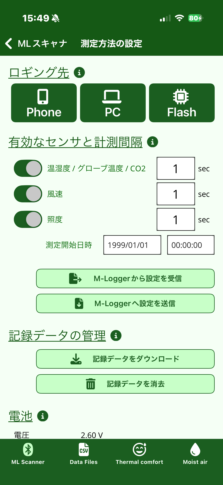
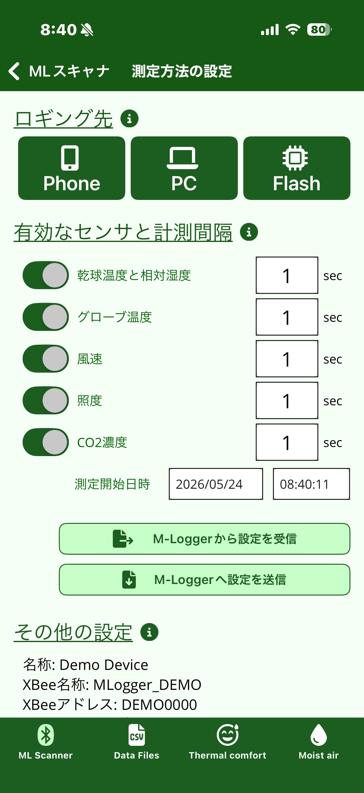
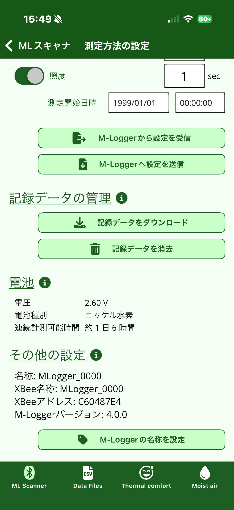
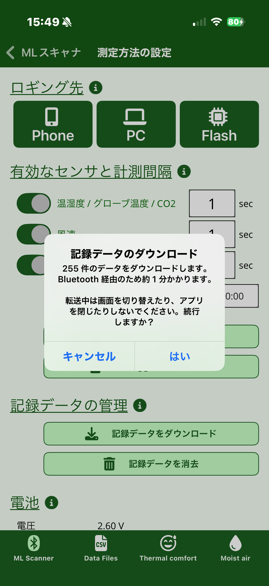
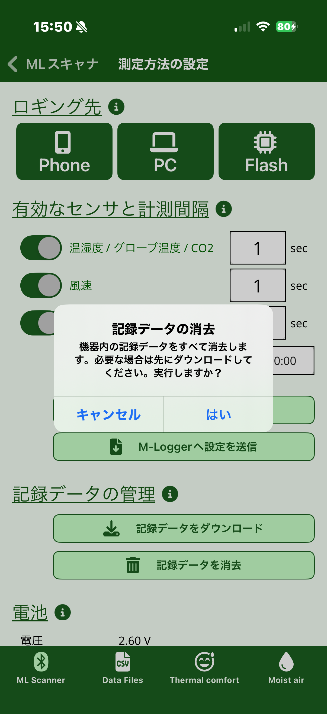
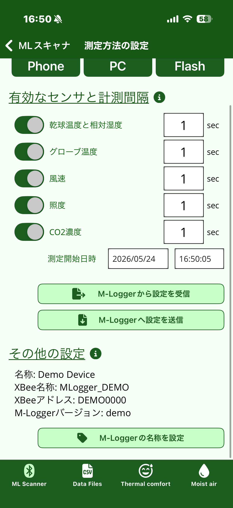
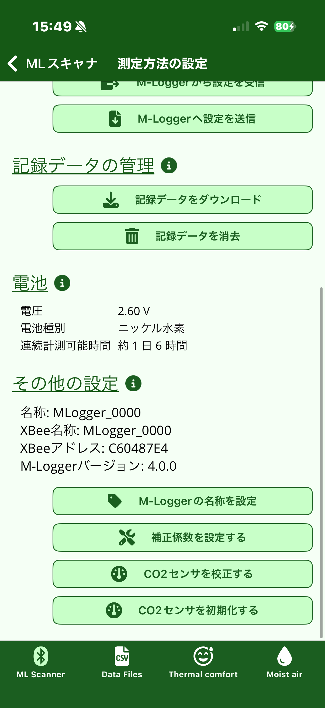
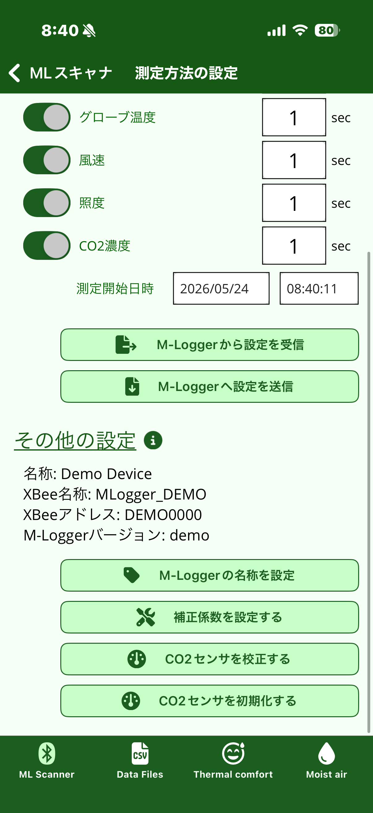

# 計測の設定

M-Logger を選択すると **測定方法の設定** 画面が開きます。
この画面で「何を」「どこへ」「いつから」記録するかを決めて、M-Logger に書き込みます。

!!! info "v3 / v4 ファームウェアで画面構成が異なります"
    お使いの M-Logger のファームウェアバージョンに応じてアプリの UI が自動で
    切り替わります。バージョンの見分け方は [トップページ](index.md#お使いの-m-logger-のファームウェアバージョン) を参照してください。
    以下、画面構成が異なる箇所はタブで示します。

=== "v4 ファームウェア (新型)"

    { width="280" }

=== "v3 ファームウェア (従来型)"

    { width="280" }

## ロギング先

計測値の保存先を Phone / PC / Flash の 3 つから選びます。

- **Phone**: 計測中スマートフォン側に逐次保存。最も手軽。
- **PC**: PC + Zigbee で受信して PC 側に保存。複数台同時運用向け ([詳細設定](advanced.md#pc-との通信))。
- **Flash**: M-Logger 本体のフラッシュメモリへ保存。スマートフォン / PC との通信なしに長期スタンドアロン運用が可能。

!!! note "v3 / v4 で取得方法が異なります"
    - **v4** では Flash に記録した後、スマートフォンからも Bluetooth 経由で取り出せます (詳細は [記録データの管理](#記録データの管理) 参照)。
    - **v3** ではスマートフォンから取り出せないため、計測終了後に **PC** に **USB Type-C** ケーブルで接続してデータを吸い上げます。

## 有効なセンサと計測間隔

各項目の ON/OFF と計測間隔 (秒) を設定します。不要な項目を OFF にすると消費電力が下がり、内蔵電池のもちが延びます。

=== "v4 ファームウェア (新型)"

    センサは **3 つのカテゴリ** に集約されています。同じプローブ上で一括計測される
    センサをまとめて 1 つの設定にすることで、UI を簡潔にしました。

    | カテゴリ | 含まれるセンサ |
    |---------|---------------|
    | **温湿度 / グローブ温度 / CO2** | 乾球温度・相対湿度・グローブ温度・CO2 (一括) |
    | **風速** | 微風速 |
    | **照度** | 照度 |

    各カテゴリで ON/OFF と計測間隔 (秒) を独立に設定できます。

=== "v3 ファームウェア (従来型)"

    センサごとに ON/OFF と計測間隔 (秒) を設定します。
    対象センサは **温湿度・グローブ温度・風速・照度・CO2** の 5 種類で、
    それぞれ独立に設定できます。

## 測定開始日時

未来の日時を指定すると、その時刻まで待機してから自動的に計測を開始します。
予約計測 (例: 翌朝 9 時から自動開始) に使います。

## M-Logger との設定送受信

- **「M-Logger から設定を受信」**: M-Logger に現在書き込まれている設定をスマートフォンへ取り込みます。すでに使用中の M-Logger の設定を確認・流用するときに使います。
- **「M-Logger へ設定を送信」**: 編集中の設定を M-Logger へ書き込みます。**送信して初めて M-Logger 側に反映されます**。

## 記録データの管理

!!! note "v4 ファームウェアのみ表示"
    本セクションは v4 ファームウェアでのみ画面に出てきます。v3 ファームウェアでは内蔵フラッシュの取り出しに USB Type-C 接続が必要です。

内蔵フラッシュに記録したデータをスマートフォンへ取り出したり、消去したりできます。

{ width="280" }

### 記録データをダウンロード

「ダウンロード」をタップすると、件数と予想所要時間を提示する確認ダイアログが表示されます。

{ width="280" }

- **Bluetooth 経由のため転送に時間がかかります** (実効 ~2 KB/sec)。10,000 件で約 1〜2 分、月間記録 (60 秒間隔の 1 か月分・約 43,000 件) で約 5〜6 分が目安
- 転送中は画面遷移できなくなります (アプリを閉じない、別のタブに移らない)
- ダウンロード中は **本体の赤 LED が点滅** して「操作不能」を示します
- 取得した CSV は [Data Files タブ](data.md) に **`-M` マーカー + 淡 blue 背景** で識別されて保存されます

### 記録データを消去

「消去」をタップすると、機器内の記録データをすべて削除して新しい計測のための容量を空けます。

{ width="280" }

!!! warning "消去後は復元できません"
    必要なデータは先に「ダウンロード」で取り出してから消去してください。

機器のフラッシュが満杯 (約 144 万件) になると自動的に記録が止まります。定期的に **ダウンロード + 消去** することで継続的に新しいデータを記録できます。

## 電池

!!! note "v4 ファームウェアのみ表示"
    本セクションは v4 ファームウェアでのみ画面に出てきます。

{ width="280" }

- **電圧**: 本画面を開いたタイミングで取得した VBAT 電圧
- **電池種別**: 起動電圧から推定した種別 (新品電池前提)。実際に入れた電池と異なる場合は新品でない/異常電池の可能性
- **連続計測可能時間**: 現在の設定で新品 2000mAh 電池を使ったときの目安。消費電力が大きい風速計の計測間隔を伸ばすと大きく延びます

参考値です。実際の連続計測可能時間は温度・自己放電・電池個体差で ±30% 程度のばらつきが出ます。

## その他の設定

=== "v4 ファームウェア (新型)"

    { width="280" }

=== "v3 ファームウェア (従来型)"

    { width="280" }

「その他の設定」セクションでは、通常状態では以下が表示されます。

- 名称・XBee 名称・XBee アドレス・ファームウェアバージョン (情報表示のみ)
- **M-Logger の名称を設定**: M-Logger の表示名を変更

通常の計測ではこれだけ把握しておけば十分で、以下の上級設定は意図的に画面に出てきません。

## シェイクで上級設定を呼び出す

スマートフォンを **1 回シェイク** (軽く 1 往復振る) すると、「その他の設定」セクションに以下のボタンが追加で表示されます。
**もう 1 回シェイクすると元に戻り**、再び非表示になります。

=== "v4 ファームウェア (新型)"

    { width="280" }

=== "v3 ファームウェア (従来型)"

    { width="280" }

- **補正係数を設定する**
- **CO2 センサを校正する**
- **CO2 センサを初期化する**

これらは設定を誤ると M-Logger の挙動が変わってしまうため、通常メニューからは隠してあります。
シェイクで露出させたうえで、自覚的に操作するという扱いです。

各項目の意味と使い方は [詳細設定と常設モード](advanced.md) を参照してください。

## 計測開始

設定を M-Logger へ送信した後、ロギング先に応じたボタンで計測を開始します。

- ロギング先が **Phone** の場合: 「スマートフォンに記録」 → そのまま [計測中の表示](logging.md) 画面に移り、Back で終了します。
- ロギング先が **Flash** の場合: 「Flash モードに記録」 → 開始ボタンを押した時点で画面が ML Scanner に戻り、M-Logger は自律的に計測を継続します。**以降は M-Logger の電源を切るまで Bluetooth 接続を受け付けません** (※ v4 ファームウェアの場合は計測停止後にダウンロード可能)。
- ロギング先が **PC** の場合: 「PC へ送信」 → Flash と同様、開始ボタンで画面が ML Scanner に戻ります。以降のデータ受信は PC + Zigbee 側で行います。
