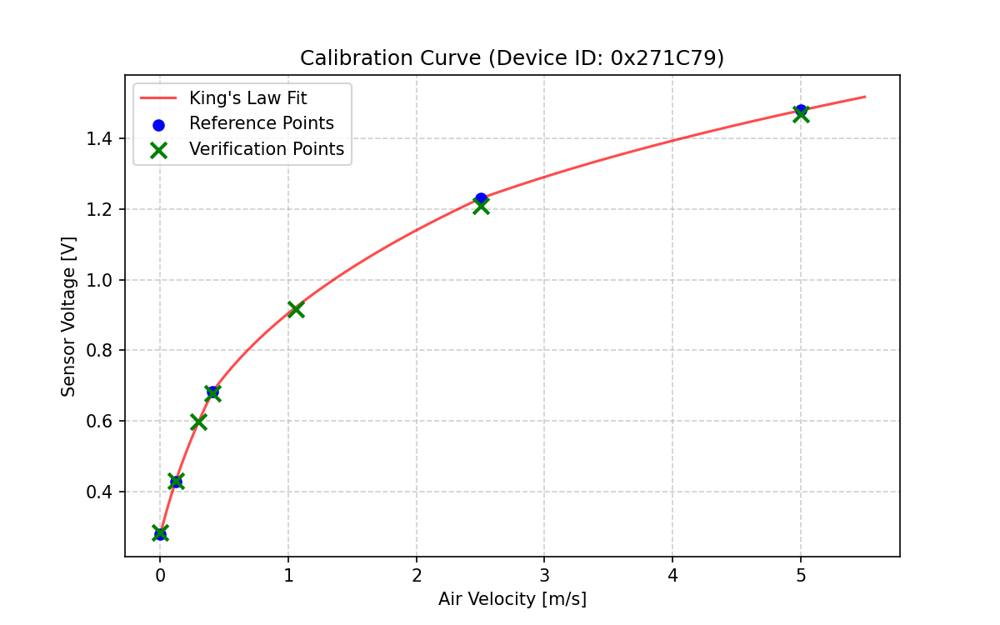

# Anemometer Calibration Report

## 1. Device Information
- **Device ID (FNV-1a 22bit)**: `0x271C79` (2563193)
- **Device Name**: ``
- **Calibration Date**: 2026-05-21 12:45:11

## 2. Phase 1: Reference Measurements
| Fan Power | Ref Velocity [m/s] | Measured Voltage [V] | StdDev [V] |
|---|---|---|---|
| 0% | 0.00 | 0.2780 | 0.0174 |
| 7% | 0.12 | 0.4276 | 0.0088 |
| 12% | 0.41 | 0.6832 | 0.0019 |
| 40% | 2.50 | 1.2300 | 0.0041 |
| 74% | 5.00 | 1.4794 | 0.0032 |

## 3. Phase 2: Estimated Coefficients (King's Law, 3-range)
Formula: $v = e^{m \cdot \ln(E^2 - E_0^2) + \ln(C)}$

- **Common $E_0$ (Zero-wind)**: `0.278033 V`
### Range 1 (Low, v < 0.41 m/s)
- **Slope ($m_1$)**: `9.411806e-01`
- **Intercept ($\ln(C_1)$)**: `-4.092230e-03`
### Range 2 (Mid, 0.41 <= v < 2.50 m/s)
- **Slope ($m_2$)**: `1.385791e+00`
- **Intercept ($\ln(C_2)$)**: `4.151626e-01`
### Range 3 (High, v >= 2.50 m/s)
- **Slope ($m_3$)**: `1.797049e+00`
- **Intercept ($\ln(C_3)$)**: `2.664440e-01`

## 4. Phase 3: Verification Results
| Ref Velocity [m/s] | Measured Velocity [m/s] | Error [%] | Measured Voltage [V] |
|---|---|---|---|
| 0.00 | 0.007 | 0.0% | 0.2829 |
| 0.12 | 0.123 | 2.5% | 0.4307 |
| 0.30 | 0.299 | 0.3% | 0.5965 |
| 0.41 | 0.401 | 2.2% | 0.6766 |
| 1.06 | 1.040 | 1.9% | 0.9163 |
| 2.50 | 2.372 | 5.1% | 1.2080 |
| 5.00 | 4.866 | 2.7% | 1.4687 |

- **Maximum Verification Error**: `5.1%`

## 5. Calibration Visualization

